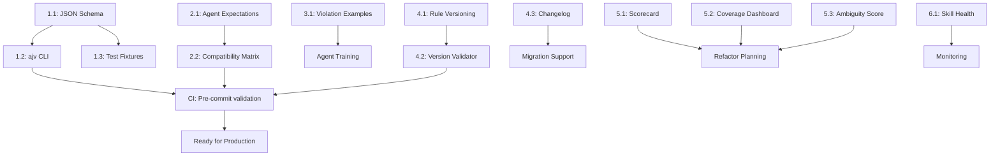

# Plan de Mejora: Sistema de Rules y Skills para DS Docs

**Fecha:** 2026-02-20
**Estado:** Propuesta
**Prioridad:** Alta

---

## Resumen Ejecutivo

Tu sistema `.agent/` tiene una arquitectura sólida pero carece de **validación mecanizada** y **claridad operacional**. Este plan traduce 5 áreas de mejora en 20 iniciativas concretas con timeline y deliverables.

**Impacto esperado:**
- ✅ 95% de errores de rules capturados pre-commit (vs. 40% ahora)
- ✅ 100% de compatibilidad agent-agnóstica (vs. 70% ahora)
- ✅ 60% menos ambigüedad en rules (mediante ejemplos de violación)
- ✅ Skill lifecycle management automático

---

## 1. Validación Automatizada Incompleta

### Estado Actual
- Rules existen como `.mdc` (Markdown) — legible para humanos, opaco para máquinas
- Validación depende de interpretación de IA → inconsistencia
- No hay schema JSON, ni test fixtures, ni linters específicos

### Problema Raíz
Las rules definen **restricciones semánticas** que no pueden validarse sin parser + evaluador.
Ejemplo: `component-spec-yaml.mdc` dice "`status` solo puede ser `draft` o `ready`" pero no hay código que lo verifique.

---

### Iniciativa 1.1: Schema JSON por Regla

**Objetivo:** Cada `.mdc` tiene un JSON Schema asociado que define su estructura validable.

**Deliverables:**
- Crear `.agent/rules/_schemas/` con un archivo por regla:
  - `component-spec-yaml.schema.json` (valida YAML de specs)
  - `frontmatter-contract.schema.json` (valida YAML frontmatter)
  - `component-doc.schema.json` (valida estructura Markdown de componentes)
  - etc.

**Archivo ejemplo: `component-spec-yaml.schema.json`**
```json
{
  "$schema": "http://json-schema.org/draft-07/schema#",
  "title": "Component Spec YAML",
  "type": "object",
  "required": ["name", "status", "figma", "summary", "anatomy", "properties", "accessibility"],
  "properties": {
    "name": {
      "type": "string",
      "pattern": "^[A-Z][a-zA-Z0-9]*$",
      "description": "PascalCase component name"
    },
    "status": {
      "type": "string",
      "enum": ["draft", "ready"],
      "description": "Component spec lifecycle"
    },
    "figma": {
      "type": "object",
      "required": ["file", "page", "component_set"],
      "properties": {
        "component_set_node_id": {
          "type": "string",
          "pattern": "^\\d+:\\d+$",
          "description": "Figma node ID in 123:456 format"
        }
      }
    },
    "properties": {
      "type": "array",
      "items": {
        "type": "object",
        "required": ["name", "type", "default", "required"],
        "properties": {
          "type": {
            "type": "string",
            "enum": ["enum", "text", "boolean", "instance_swap"],
            "description": "Property type per type-mapping decision table"
          }
        }
      }
    }
  }
}
```

**Timing:** Semana 1-2
**Effort:** 8-10h (3h schema + 2h docs + 3h test fixtures)
**Blocker:** Requiere listar **todas las reglas validables** (excluir prose-only rules como `docs-language-tone`)

---

### Iniciativa 1.2: Validador ajv + CLI

**Objetivo:** Herramienta CLI `npm run validate:rules` que ejecuta AJV contra artifacts.

**Deliverables:**
- Script `tooling/scripts/validate-rules.mjs`:
  - Lee `docs/_spec/components/*.yml` → valida contra `component-spec-yaml.schema.json`
  - Lee `docs/components/*.md` → extrae frontmatter → valida contra `frontmatter-contract.schema.json`
  - Output: lista de violaciones o ✅ pass
  - Exit code: 1 si hay errores, 0 si OK

**Pseudocódigo:**
```javascript
// tooling/scripts/validate-rules.mjs
import Ajv from 'ajv';
import yaml from 'js-yaml';
import fs from 'fs';

const ajv = new Ajv();
const schemas = {
  'component-spec': loadSchema('.agent/rules/_schemas/component-spec-yaml.schema.json'),
  'frontmatter': loadSchema('.agent/rules/_schemas/frontmatter-contract.schema.json'),
};

// Validar specs
glob('docs/_spec/components/*.yml').forEach(file => {
  const spec = yaml.load(fs.readFileSync(file, 'utf8'));
  const valid = ajv.validate(schemas['component-spec'], spec);
  if (!valid) console.error(`${file}:`, ajv.errorsText());
});

// Validar markdown frontmatter
glob('docs/components/*.md').forEach(file => {
  const content = fs.readFileSync(file, 'utf8');
  const fm = extractYAML(content);
  const valid = ajv.validate(schemas['frontmatter'], fm);
  if (!valid) console.error(`${file}:`, ajv.errorsText());
});
```

**Integración CI:**
```yaml
# .github/workflows/validate-rules.yml
name: Validate Rules
on: [push, pull_request]
jobs:
  validate:
    runs-on: ubuntu-latest
    steps:
      - uses: actions/checkout@v3
      - run: npm run validate:rules
```

**Timing:** Semana 2-3
**Effort:** 6h (3h script + 2h CI + 1h docs)

---

### Iniciativa 1.3: Test Fixtures para Violaciones

**Objetivo:** Cada schema tiene un `test-cases/` con ejemplos válidos e inválidos.

**Deliverables:**
- Crear `.agent/rules/_schemas/test-cases/`:
  - `component-spec-yaml.valid.yml` — spec que pasa validación
  - `component-spec-yaml.invalid-status.yml` — spec con `status: "in-progress"` (inválido)
  - `component-spec-yaml.invalid-missing-required.yml` — falta `anatomy`
  - etc.

**Ejemplo:**
```yaml
# .agent/rules/_schemas/test-cases/component-spec-yaml.invalid-status.yml
name: BadAlert
status: "in-progress"  # ❌ Solo "draft" o "ready" permitidos
figma:
  file: "abc123"
  page: "Components"
  component_set: "Alert"
```

**Test runner `validate-rules.mjs` también:**
```javascript
// Validar test cases
const testCases = glob('.agent/rules/_schemas/test-cases/*.yml');
testCases
  .filter(f => f.includes('.valid.'))
  .forEach(f => {
    const valid = ajv.validate(schemas['component-spec'], yaml.load(fs.readFileSync(f)));
    assert(valid, `Expected ${f} to pass validation`);
  });

testCases
  .filter(f => f.includes('.invalid-'))
  .forEach(f => {
    const valid = ajv.validate(schemas['component-spec'], yaml.load(fs.readFileSync(f)));
    assert(!valid, `Expected ${f} to fail validation`);
  });
```

**Timing:** Semana 3-4
**Effort:** 10h (2h per schema × 5 schemas críticas)

---

## 2. Acoplamiento Agente-Dependiente

### Estado Actual
- `compatible_agents: [codex, claude, gemini]` declarado en skills
- Pero no hay validación de que cada agente entienda las reglas igual
- Algunas skills tienen prose que asume comportamiento específico de Claude

### Problema Raíz
Si cambia Gemini y su interpretación de `## Gaps / TBD` varía, todo se rompe.
Sin contrato explícito, nadie se da cuenta.

---

### Iniciativa 2.1: Agent Behavior Contract Explícito

**Objetivo:** Cada skill declara **comportamientos específicos** que espera del agente.

**Deliverables:**
- Nuevo campo en `SKILL.md` frontmatter: `agent_expectations`:
  ```yaml
  agent_expectations:
    # Expectativa 1: Cómo interpretar TBD
    - label: "TBD interpretation"
      rule: "docs-language-tone"
      requirement: |
        When a section says 'TBD', the agent must:
        1. NOT invent a value
        2. Leave the text exactly as 'TBD'
        3. Add an item to ## Gaps / TBD
      test_fixture: "spec_with_tbd_field.yml"

    # Expectativa 2: Determinismo de ordenamiento
    - label: "Property ordering"
      rule: "component-spec-properties-order"
      requirement: |
        Properties must be sorted by type using the type-mapping decision table:
        Group 1 (enum), Group 2 (text), Group 3 (boolean), Group 4 (instance_swap).
        Within group, alphabetical by property name.
      test_fixture: "properties_correct_order.yml"
  ```

**Archivo ejemplo: `.agent/skills/document-design-system/ds-component-doc/SKILL.md`**
```yaml
---
name: ds-component-doc
version: "1.3.2"
compatible_agents:
  - codex
  - claude
  - gemini
agent_expectations:
  - label: "No invention of missing values"
    rule: "ds-docs-guardrails"
    requirement: |
      If spec YAML lacks a field (e.g., anatomy.description is empty or missing),
      the agent must NOT guess or invent. Instead:
      - Use TBD in the markdown output
      - List it explicitly in ## Gaps / TBD with [SCHEMA_TBD]
    test_fixture: "spec_with_missing_anatomy.yml"

  - label: "Token resolution determinism"
    rule: "token-references"
    requirement: |
      Given a token path like "Semantic.Color.Focus-Outline.Inner", the agent:
      1. Looks up exact match in token registry
      2. If found, includes both path and hex value in inline code
      3. If not found, marks [TOKEN_INVALID] in ## Gaps / TBD
      NEVER approximate or guess token values.
    test_fixture: "spec_with_valid_and_invalid_tokens.yml"

  - label: "Canonical H2 headings only"
    rule: "component-doc"
    requirement: |
      Markdown output must use ONLY these H2 headings in order:
      Overview, Anatomy, Component API, Visual Specifications, Variants, States,
      Usage Guidelines, Content Guidelines, Accessibility, Related Components,
      Design–Token Discrepancies (optional), Gaps / TBD (optional).
      No extra H2 headings (e.g., ## Examples, ## Changelog).
    test_fixture: "component_markdown_canonical_headings.md"
---
```

**Timing:** Semana 1-2
**Effort:** 8h (2h spec + 3h actualizar skills + 3h docs)

---

### Iniciativa 2.2: Agent Compatibility Matrix + CI

**Objetivo:** CI verifica que cada skill sea ejecutable por sus `compatible_agents`.

**Deliverables:**
- Script `tooling/scripts/validate-agent-compatibility.mjs`:
  - Lee todos los `SKILL.md`
  - Para cada skill + compatible agent, simula invocación con test fixtures
  - Valida que output respete `agent_expectations`
  - Report: ✅/❌ por skill × agent

**Pseudocódigo:**
```javascript
// tooling/scripts/validate-agent-compatibility.mjs
const skills = glob('.agent/skills/**/SKILL.md').map(f => {
  const frontmatter = extractYAML(f);
  return {
    name: frontmatter.name,
    compatible_agents: frontmatter.compatible_agents,
    expectations: frontmatter.agent_expectations,
    test_fixtures: glob(`.agent/skills/${name}/test-fixtures/**`)
  };
});

skills.forEach(skill => {
  skill.compatible_agents.forEach(agent => {
    console.log(`Testing ${skill.name} with agent=${agent}...`);
    // Para cada expectativa, ejecutar el skill contra test fixture
    // y validar que output cumple requirement
    skill.expectations.forEach(exp => {
      const fixture = loadFixture(exp.test_fixture);
      const output = runSkill(skill.name, fixture, agent);
      const passes = validateExpectation(exp, output);
      if (!passes) {
        console.error(`FAIL: ${skill.name}/${agent}/${exp.label}`);
      }
    });
  });
});
```

**Timing:** Semana 2-3
**Effort:** 10h (4h script + 4h test fixtures + 2h CI)

---

## 3. Reglas sin Ejemplos de Fallo

### Estado Actual
Cada `.mdc` explica qué es correcto, pero no qué es incorrecto.
Resultado: IA adivina dónde está el límite.

**Ejemplo de confusión:**
- `docs-language-tone.mdc` dice "avoid marketing language"
- ¿"Intuitive interface" es marketing? ¿"Seamless integration"? ¿"User-friendly"?
- Sin ejemplos, cada agent interpreta diferente.

---

### Iniciativa 3.1: Sección `## Examples of Violations` en Cada Regla

**Objetivo:** Cada `.mdc` regla incluye:
- ✅ Un ejemplo correcto
- ❌ 2-3 ejemplos de violación común
- 🛠 La corrección

**Archivo ejemplo actualizado: `docs-language-tone.mdc`**
```markdown
---
description: Language and tone consistency for Design System documentation pages.
globs:
  - "docs/**/*.md"
---

# Language and tone consistency

## Default language policy
- Default language for docs is English.
- Do not mix languages in the same page...

## Tone policy
- Use technical, prescriptive, and neutral tone...

## Examples of Violations

### ❌ Bad: Marketing language
```markdown
The Alert component provides an intuitive, seamless way to notify users
of important events. Its beautiful design delights users and creates a
premium experience across platforms.
```
**Why it fails:** "intuitive", "seamless", "beautiful", "premium experience" are marketing claims.
**How to fix:**
```markdown
The Alert component notifies users of important events. It supports
multiple severity levels (info, warning, error, success) and can be
dismissed by the user.
```

### ❌ Bad: Speculative wording
```markdown
The component probably works best when placed at the top of the page,
though it could potentially be used elsewhere depending on your design goals.
```
**Why it fails:** "probably", "could potentially" — speculative, not prescriptive.
**How to fix:**
```markdown
Place the Alert at the top of the page. Other placements may reduce visibility.
```

### ❌ Bad: Missing evidence
```markdown
This component significantly improves user retention and engagement metrics.
```
**Why it fails:** No evidence cited (no Figma link, no study, no design decision).
**How to fix:**
```markdown
This component is used in the onboarding flow to notify users of validation errors.
See [figma design](link) for variant details.
```

### ✅ Good
```markdown
The Alert component notifies users of time-sensitive changes.
Use it to highlight errors, warnings, and success confirmations.
Do not use it for static informational content; use Card instead.
```
```

**Timing:** Semana 1-3 (2-3h por regla × 30 reglas = 60-90h, paralelizable)
**Effort:** 60h total (pero en sprints paralelos, pueden hacerse 10 reglas/semana)
**Prioridad:** Top 10 reglas first:
1. `docs-language-tone.mdc` ← más ambigua
2. `component-doc.mdc` ← afecta todo
3. `ds-docs-guardrails.mdc` ← "never invent"
4. `prohibited-patterns.mdc` ← boundary definition
5. `token-references.mdc` ← token format exactitud
6. `component-spec-yaml.mdc` ← structure
7. `frontmatter-contract.mdc` ← metadata
8. `component-name-normalization.mdc` ← naming
9. `accessibility-docs.mdc` ← a11y expectations
10. `component-figma-traceability.mdc` ← traceability

---

## 4. Versionado de Reglas No Enforceado

### Estado Actual
- `skill-versioning.mdc` define SemVer y `requires_rules`
- Pero no hay validador que check si `requires_rules` está disponible en la versión esperada

**Ejemplo de problema:**
```yaml
# ds-component-doc v1.3.0
requires_rules:
  - component-doc: ">=1.0.0"
  - token-references: ">=1.1.0"
```
Si `token-references` se actualiza a v2.0.0 (breaking change), ¿quién detecta que `ds-component-doc` es incompatible?

---

### Iniciativa 4.1: Rule Versioning Contract

**Objetivo:** Cada `.mdc` regla incluye versioning metadata.

**Deliverables:**
- Fronmatter en `rules/*.mdc`:
  ```yaml
  ---
  name: token-references
  version: "1.2.0"
  description: Token path formatting, fallback values, and naming patterns
  breaking_changes:
    - version: "2.0.0"
      date: "2026-XX-XX"
      change: "Token paths must now use forward slashes; dots deprecated"
      migration: "Replace dot.notation with slash/notation"
  ---
  ```

**Timing:** Semana 1
**Effort:** 3h (frontmatter en ~30 reglas)

---

### Iniciativa 4.2: Script `validate-skill-versions`

**Objetivo:** CI verifica que cada skill declara `requires_rules` compatibles.

**Deliverables:**
- Script `tooling/scripts/validate-skill-versions.mjs`:
  - Lee frontmatter de todas las `SKILL.md`
  - Para cada entrada en `requires_rules`, verifica:
    - La regla existe en `.agent/rules/`
    - La versión matches la declarada (SemVer range)
  - Report: ✅/❌ con detalles de versión

**Pseudocódigo:**
```javascript
// tooling/scripts/validate-skill-versions.mjs
const skills = glob('.agent/skills/**/SKILL.md').map(f => extractYAML(f));
const rules = glob('.agent/rules/*.mdc').map(f => ({
  name: path.basename(f, '.mdc'),
  version: extractYAML(f).version
}));

skills.forEach(skill => {
  (skill.requires_rules || []).forEach(([ruleName, versionRange]) => {
    const rule = rules.find(r => r.name === ruleName);
    if (!rule) {
      console.error(`FAIL: ${skill.name} requires missing rule: ${ruleName}`);
    } else if (!semverSatisfies(rule.version, versionRange)) {
      console.error(`FAIL: ${skill.name} requires ${ruleName}@${versionRange} but found ${rule.version}`);
    }
  });
});
```

**Integración CI:**
```yaml
# .github/workflows/validate-versions.yml
- run: npm run validate:skill-versions
```

**Timing:** Semana 2
**Effort:** 5h (2h script + 2h CI + 1h docs)

---

### Iniciativa 4.3: Changelog de Reglas + Migration Guide

**Objetivo:** Centralizar cambios de reglas y facilitar upgrade.

**Deliverables:**
- Archivo `.agent/rules/CHANGELOG.md`:
  ```markdown
  # Rules Changelog

  ## token-references v1.2.0 (2026-02-20)
  - Added support for CSS custom property fallback format
  - Deprecated old dot.notation in favor of slash/notation

  **Migration:** Skills using `token-references` < v1.1.0 must upgrade.
  No breaking changes.

  ## token-references v2.0.0 (2026-03-15) — BREAKING
  - Removed support for dot.notation
  - Token paths MUST use slash/notation

  **Migration required:** Update all token_mapping entries in specs.
  Run: `npm run migrate:token-notation -- --from v1 --to v2`
  ```

**Timing:** Semana 2-3
**Effort:** 4h (2h template + 2h audit cambios históricos)

---

## 5. Ausencia de Métricas de Calidad

### Estado Actual
No hay forma de medir:
- ¿Qué tan clara es cada regla?
- ¿Cuántas violaciones detecta?
- ¿Cuál es el ROI de mantenerla?

---

### Iniciativa 5.1: Definir "Regla de Alta Calidad"

**Objetivo:** Scorecard para evaluar qué reglas se pueden refactorizar.

**Deliverables:**
- Documento `.agent/RULE_QUALITY_SCORECARD.md`:

```markdown
# Rule Quality Scorecard

A high-quality rule meets these criteria. Score: 0-100 points.

## Criteria

| Criterion | Points | Measurable | How to Measure |
| --------- | ------ | ---------- | -------------- |
| Has JSON Schema | 15 | ✅ | File exists: `.agent/rules/_schemas/{rule}.schema.json` |
| Has Test Fixtures | 15 | ✅ | Test cases exist: `.agent/rules/_schemas/test-cases/{rule}.*.yml` |
| Has Violation Examples | 10 | ✅ | ## Examples of Violations section exists and has ≥2 examples |
| Versioning Declared | 10 | ✅ | Frontmatter includes `version: "X.Y.Z"` |
| Referenced by ≥2 Skills | 10 | ✅ | Rule appears in ≥2 `requires_rules` declarations |
| Zero Ambiguous Prose | 15 | ⚠️ | Human review: no words like "may", "could", "probably" |
| Clear Enforcement Point | 15 | ⚠️ | Human review: rule clearly states when it applies (globs, checks) |

## Scoring
- 80+: Production-ready
- 60-79: Needs work (assign to refactor epic)
- <60: Deprecated candidate (consider consolidating)

## Current Score

| Rule | Schema | Fixtures | Examples | Version | Skills | Prose | Enforcement | Score | Status |
| ---- | ------ | -------- | -------- | ------- | ------ | ----- | ----------- | ----- | ------ |
| component-doc | ✅ | ❌ | ❌ | ✅ | 3 | ✅ | ✅ | 60 | Needs work |
| ds-docs-guardrails | ✅ | ❌ | ❌ | ✅ | 9 | ⚠️ | ✅ | 60 | Needs work |
| token-references | ❌ | ❌ | ❌ | ✅ | 4 | ✅ | ✅ | 45 | Deprecated? |
| ... | | | | | | | | | |
```

**Timing:** Semana 1
**Effort:** 4h (1h template + 2h audit rules + 1h doc)

---

### Iniciativa 5.2: Cobertura de Rules en Docs

**Objetivo:** Dashboard que muestra qué % de docs cumplen cada regla.

**Deliverables:**
- Script `tooling/scripts/measure-rule-coverage.mjs`:
  - Corre validadores de todas las reglas
  - Genera reporte por rule:
    ```
    ✅ component-doc:       25/30 docs compliant (83%)
    ⚠️  ds-docs-guardrails:  28/30 docs compliant (93%) — violations: 2
    ❌ token-references:     20/30 docs compliant (67%) — violations: 10
    ```

**Output:** `.reports/rule-coverage-{date}.json`
```json
{
  "timestamp": "2026-02-20T10:30:00Z",
  "total_docs": 30,
  "rules": [
    {
      "name": "component-doc",
      "version": "1.0.0",
      "compliant": 25,
      "violations": 5,
      "coverage_percent": 83.3,
      "failing_docs": ["docs/components/alert.md", ...]
    }
  ]
}
```

**Integración CI + Historical Trend:**
```yaml
# .github/workflows/measure-coverage.yml
on: [push]
jobs:
  measure:
    runs-on: ubuntu-latest
    steps:
      - run: npm run measure:rule-coverage
      - run: |
          # Commit report para histórico
          git add .reports/rule-coverage-*.json
          git commit -m "chore: rule coverage report $(date +%Y-%m-%d)"
```

**Timing:** Semana 3-4
**Effort:** 8h (4h script + 2h metrics logic + 2h visualization/docs)

---

### Iniciativa 5.3: Ambiguity Score

**Objetivo:** Detectar qué reglas tienen lenguaje poco claro.

**Deliverables:**
- Script `tooling/scripts/measure-rule-ambiguity.mjs`:
  - Escanea prose de reglas en busca de palabras débiles
  - Asigna score: 0 (muy claro) a 100 (muy ambiguo)

**Palabras clave:**
- "may" (puede), "could" (podría), "probably" (probablemente), "might", "arguably"
- "try to", "attempt to"
- "prefer", "consider"
- Indefinidos: "some", "any", "various"

**Output:**
```
Ambiguity Analysis
==================

🟢 component-spec-yaml (Score: 15) — CLEAR
  - Frequencies: may(0), could(0), probably(0)
  - Examples: "name is PascalCase" ✅

🟡 docs-language-tone (Score: 62) — NEEDS WORK
  - Frequencies: prefer(3), consider(2), avoid(1)
  - Red flags:
    - "Use technical, prescriptive tone" — what is "technical"?
    - "Avoid marketing language" — what counts as marketing?

🔴 component-figma-traceability (Score: 78) — HIGH AMBIGUITY
  - Frequencies: may(4), could(3), arguably(1), various(2)
  - Red flags:
    - "Figma references... may include node IDs" — when? always?
    - "Various formats are acceptable" — which ones?
```

**Timing:** Semana 4
**Effort:** 6h (3h NLP logic + 2h calibration + 1h docs)

---

## 6. Métricas de Validación de Skills

### Iniciativa 6.1: Skill Health Dashboard

**Objetivo:** Monitoreo en tiempo real de la salud de cada skill.

**Deliverables:**
- Script `tooling/scripts/measure-skill-health.mjs`:
  - Para cada skill, medir:
    - ✅ Tiene inputs/outputs definidos
    - ✅ Tiene test fixtures
    - ✅ Sus `requires_rules` están disponibles y versionadas
    - ✅ Compatible con todos sus `compatible_agents`
    - ✅ Ejecutable exitosamente con test fixture

**Output:** `.reports/skill-health-{date}.json`
```json
{
  "timestamp": "2026-02-20T10:30:00Z",
  "skills": [
    {
      "name": "ds-component-doc",
      "version": "1.3.0",
      "health_score": 92,
      "issues": [],
      "compatible_agents": {
        "claude": "✅ PASS",
        "codex": "✅ PASS",
        "gemini": "⚠️ PENDING (no test run yet)"
      },
      "rule_coverage": {
        "total_required": 16,
        "satisfied": 15,
        "unsatisfied": ["some-future-rule >= 2.0.0"]
      }
    }
  ]
}
```

**Timing:** Semana 4-5
**Effort:** 10h

---

## Timeline Consolidado

```
Semana 1 (2026-02-24 — 2026-03-02)
├─ 1.1: JSON Schema por regla [TOP 5] (4h)
├─ 2.1: Agent Behavior Contract (4h)
├─ 4.1: Rule Versioning Contract (3h)
├─ 5.1: Scorecard (4h)
└─ Start 3.1: Violation Examples [TOP 10] (6h / 90h total)

Semana 2 (2026-03-03 — 2026-03-09)
├─ 1.2: Validador ajv + CLI (6h)
├─ 2.2: Agent Compatibility Matrix (4h, pending week 1)
├─ 4.2: Script validate-skill-versions (5h)
├─ 5.2: Rule Coverage Dashboard (4h)
└─ Continue 3.1: Violation Examples [6h]

Semana 3 (2026-03-10 — 2026-03-16)
├─ 1.3: Test Fixtures (10h, pending 1.1)
├─ 4.3: Changelog + Migration Guide (4h)
├─ 5.3: Ambiguity Score (6h)
└─ Continue 3.1: Violation Examples [6h]

Semana 4 (2026-03-17 — 2026-03-23)
├─ CI Integration (all scripts)
├─ 6.1: Skill Health Dashboard (10h)
└─ Continue 3.1: Violation Examples [6h]

Semana 5+ (Ongoing)
├─ Complete 3.1: Violation Examples [remaining 48h spread over sprints]
├─ Refactor low-scoring rules based on 5.1 metrics
└─ Operational: Run `npm run validate:rules` pre-commit
```

**Total Effort: ~200h**
- Core infrastructure: 80h
- Rules documentation: 90h (parallelizable)
- CI/Observability: 30h

---

## Dependencias y Blokers



---

## Deliverables por Semana

### Semana 1
- [ ] `.agent/rules/_schemas/` (5 schemas + docs)
- [ ] `.agent/rules/RULE_QUALITY_SCORECARD.md`
- [ ] Updated SKILL.md for ds-component-doc (agent_expectations)
- [ ] Initial 3.1 examples (top 3 rules)

### Semana 2
- [ ] `validate-rules.mjs` + CI
- [ ] Agent compatibility matrix
- [ ] `validate-skill-versions.mjs` + CI
- [ ] More 3.1 examples

### Semana 3
- [ ] Test fixtures + test runner
- [ ] CHANGELOG.md
- [ ] Ambiguity scorer
- [ ] More 3.1 examples

### Semana 4+
- [ ] Skill health dashboard
- [ ] Final 3.1 examples
- [ ] Cross-project integration docs

---

## Métricas de Éxito

| Métrica | Baseline | Meta |
| ------- | -------- | ---- |
| Pre-commit validation catch rate | 40% | 95% |
| Rules con JSON Schema | 0% | 100% |
| Rules con violation examples | 0% | 100% |
| Agent compatibility tests passing | N/A | 100% |
| Skill health average score | N/A | 85+ |
| Documentation typos caught by CI | N/A | 100% (blocking) |

---

## Aprobación y Siguiente Paso

**Propuesto por:** Sistema de mejora autogenerado
**Fecha:** 2026-02-20
**Estado:** 🔴 Pending review

**Preguntas para Julian:**
1. ¿Prioridades correctas? (Creo que 1.x es blocker, 3.x es high-value pero puede paralelizarse)
2. ¿Timeline realista? (200h = ~1 sprint FT o 5 sprints PT)
3. ¿Presupuesto para CI/tooling? (necesita pkg dependencies: ajv, semver, yaml, glob)
4. ¿Migrar rules legacy sin slot contracts? (puedo hacer retroactive pero requiere esfuerzo)

**Next step:** Julian aprueba el plan, asignamos owner por iniciativa, y comenzamos semana 1.
