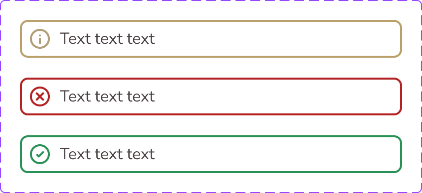

# Alert

The **Alert** component communicates concise feedback messages in a highly visible inline block.

## Overview

In Figma, this component is defined as a `COMPONENT_SET` (`Alert`) with two exposed properties:

- `Type`: `Information`, `Warning`, `Positive`
- `Change_Message_Text`: `Text text text` (default)

All variants share the same structure, spacing, and typography. Visual meaning is conveyed through semantic border and icon color tokens.

Source: [Alert in Figma](https://www.figma.com/design/3hGC1ju0d5AKzaoI9pKIyu/PFB---Design-System?node-id=2304-1892)

### Visual Proof

- Screenshot: [Captured (2026-02-21)](https://figma-alpha-api.s3.us-west-2.amazonaws.com/images/4c1a4129-8b02-48a9-8bff-2697015f9122)
- Source node: `2304:1892`
- Image hash: `e7da0999ddcd23043909e128bb8ce2270705ee31ff28fde6f2203de03aa1a58f`
- Variants captured: `3`
- Artifact: `../_generated/visual-proofs/alert.json`

## Anatomy

<!-- AUTO-GENERATED-ANATOMY:START -->
<!-- 
  ⚠️ AUTO-GENERATED: DO NOT EDIT
  Source: docs/_spec/components/alert.yml
  Generated by: ds-spec-to-markdown
-->
undefined. **undefined**
undefined. **undefined**
undefined. **undefined**

<!-- AUTO-GENERATED-ANATOMY:END -->
## Component API

### Properties

<!-- AUTO-GENERATED-PROPERTIES:START -->
<!-- 
  ⚠️ AUTO-GENERATED: DO NOT EDIT
  Source: docs/_spec/components/alert.yml
  Generated by: ds-spec-to-markdown
-->
| Name | Type | Default | Required | Description | Narrative Notes |
| --- | --- | --- | --- | --- | --- |
| Type | ENUM | Information | false | Component property. |  |
| Change_Message_Text | TEXT | Text text text | false | Text content value. |  |

<!-- AUTO-GENERATED-PROPERTIES:END -->
## Visual Specifications

### Container

- **Layout**: Auto Layout, `HORIZONTAL`
- **Item spacing**: `8px`
- **Padding**: `7px` top and bottom, `8px` left and right
- **Corner radius**: `8px`
- **Border**: `2px`, aligned `INSIDE`
- **Background token**: `Color/Background/Feedback/Default`
- **Background fallback**: `#FFFFFF`

### Typography

- **Text style**: `Regular/Body 16`
- **Font**: `Nunito Sans Regular`
- **Size / line height**: `16 / 24`
- **Letter spacing**: `0%`
- **Text color token**: `Color/Text/Neutral/Default`
- **Text color fallback**: `#483F3F`

### Iconography

- **Icon container size**: `24 x 24`
- **Internal vector size**: `18 x 18`

### Token Mapping

| Part                   | Condition    | Token                               | Fallback  |
| ---------------------- | ------------ | ----------------------------------- | --------- |
| `container.background` | all variants | `Color/Background/Feedback/Default` | `#FFFFFF` |
| `text.color`           | all variants | `Color/Text/Neutral/Default`        | `#483F3F` |

## Variants

<!-- AUTO-GENERATED-VARIANTS:START -->
<!-- 
  ⚠️ AUTO-GENERATED: DO NOT EDIT
  Source: docs/_spec/components/alert.yml
  Generated by: ds-spec-to-markdown
-->
| Variant | Token | Fallback | Notes |
| --- | --- | --- | --- |
| `N/A` | `TBD` | `TBD` | No variant axis detected. |

<!-- AUTO-GENERATED-VARIANTS:END -->
## States

This component has no interactive states in the current Figma component set.

Feedback semantics are represented through the `Type` variant, not through `hover`/`focus`/`pressed` states.

## Usage Guidelines

### Behavior

- **When to use**: Use `Information`, `Warning`, and `Positive` to communicate concise status feedback in context.
- **When not to use**: Do not use this component for persistent page-level navigation or long-form guidance.
- **Do**: Keep icon size and spacing unchanged to preserve visual rhythm.
- **Do**: Keep semantic feedback tokens aligned with the selected variant.
- **Don't**: Replace semantic border/icon tokens with neutral values.
- **Don't**: Use this component for multi-paragraph content.
- Responsive behavior: `TBD`
- Overflow / truncation behavior: `TBD`
- i18n / RTL behavior: `TBD`

### Examples

- Basic example: `Type=Information` for neutral informational feedback inside forms or cards.
- Contextual example: `Type=Warning` or `Type=Positive` for validation and result feedback after user actions.

## Content Guidelines

- Use short, direct message text.
- Prefer one sentence per alert.
- Use sentence case.
- Avoid unnecessary punctuation and repeated emphasis.

## Accessibility

### 1. ARIA role and semantics

- Expected role for passive feedback: `role="alert"`.
- If the host context already conveys live feedback semantics, use semantic HTML and avoid duplicate ARIA.
- Required ARIA attributes are `TBD` for this component configuration.

### 2. Keyboard navigation

This component is not keyboard-interactive in the current Figma configuration.

### 3. Focus management

- This component has no focusable element in the current Figma definition.
- Focus behavior for dismissible/interactive alert variants is `TBD`.
- Focus outline tokens (`Semantic.Color.Focus-Outline.Inner` (`#FFFFFF`), `Semantic.Color.Focus-Outline.Outer` (`#567680`)) are `TBD` for this component.

### 4. Labeling

- The message text itself provides the accessible content.
- Additional labeling patterns (`aria-label`, `aria-labelledby`, `aria-describedby`) are `TBD` for interactive variants.

### 5. Contrast and visibility

- The component should not rely on color alone; iconography and text must remain present with each variant.
- Verified contrast ratios are `TBD (pending audit)`.

## Related Components

- [Status Bar](status_bar.md): Use for fixed device/system chrome, not inline feedback messaging.
- [Bottom Bar](bottom_bar.md): Use for persistent action navigation, not semantic feedback.

<!-- AUTO-GENERATED-VISUALS:START -->
<!-- 
  ⚠️ AUTO-GENERATED: DO NOT EDIT
  Source: docs/_spec/components/alert.yml
  Generated by: ds-spec-to-markdown
-->
### Per-variant attributes

- `TBD`

### Layout and spacing

| Node | Direction | Alignment | H Sizing | V Sizing | Item Spacing | Padding (T/R/B/L) |
| --- | --- | --- | --- | --- | --- | --- |
| TBD | TBD | TBD | TBD | TBD | TBD | TBD |

<!-- AUTO-GENERATED-VISUALS:END -->
