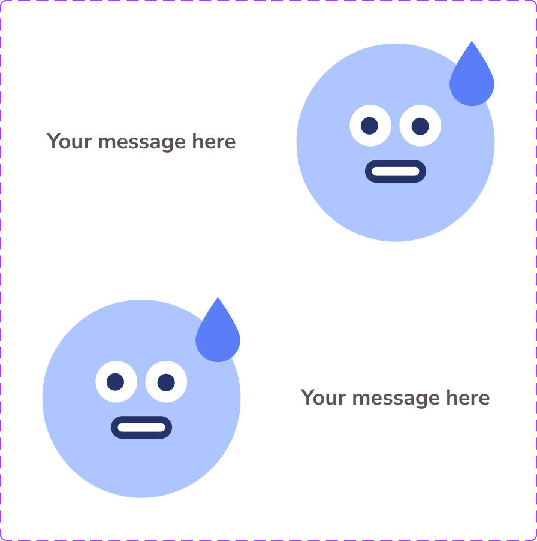

# Illustration Block

The **Illustration Block** component is documented from Figma component-set metadata and pending token-level verification.

## Overview

In Figma, this component is defined as a `COMPONENT_SET` (`Illustration-Block`) with the following properties:

- `Orientation`: `Illustration_Left`, `Illustration_Right`
- `Change_Text`: `TEXT` (default: `Your message here`)
- `Change_Illustration`: `INSTANCE_SWAP` (default: `2065:135`)

Source: [Illustration-Block in Figma](https://www.figma.com/design/3hGC1ju0d5AKzaoI9pKIyu/PFB---Design-System?node-id=2049-7813)

### Visual Proof

- Screenshot: [Captured (2026-02-21)](https://figma-alpha-api.s3.us-west-2.amazonaws.com/images/a9030242-1269-44a7-ab07-4e4205147369)
- Source node: `2049:7813`
- Image hash: `6405f3c7af3bc5bd3a74c6ca7f79b2e3674900cce14f46669d9c25beedc86dd0`
- Variants captured: `2`
- Artifact: `../_generated/visual-proofs/illustration_block.json`

## Anatomy

<!-- AUTO-GENERATED-ANATOMY:START -->
1. **Container** (`COMPONENT`): hosts the primary layout and visual surface.
2. **Content** (`TEXT/INSTANCE`): variant-dependent content slots and text values.

<!-- AUTO-GENERATED-ANATOMY:END -->
## Component API

### Properties

<!-- AUTO-GENERATED-PROPERTIES:START -->
| Name | Type | Default | Required | Description |
| --- | --- | --- | --- | --- |
| `Orientation` | `VARIANT` | `Illustration_Left` | `true` | Variant selector extracted from Figma property `Orientation`. Allowed values: `Illustration_Left`, `Illustration_Right`. |
| `Change_Text` | `TEXT` | `Your message here` | `false` | Property extracted from Figma property `Change_Text`. |
| `Change_Illustration` | `INSTANCE_SWAP` | `2065:135` | `false` | Property extracted from Figma property `Change_Illustration`. |

<!-- AUTO-GENERATED-PROPERTIES:END -->
## Visual Specifications

### Container

- Layout and spacing values are pending verification from production token mappings.
- Variant-specific visual values should be captured in token mappings below.

### Typography

- Typography tokens: `TBD`.

### Token Mapping

| Part | Condition | Token | Fallback |
| --- | --- | --- | --- |
| `container.background` | `orientation=Illustration_Left` | `TBD` | `TBD` |
| `container.background` | `orientation=Illustration_Right` | `TBD` | `TBD` |

## Variants

<!-- AUTO-GENERATED-VARIANTS:START -->
| Variant | Differentiating token(s) | Fallback value(s) | Visual indicator |
| --- | --- | --- | --- |
| `Orientation=Illustration_Left` | `TBD` | `TBD` | Variant captured from Figma property `Orientation`. |
| `Orientation=Illustration_Right` | `TBD` | `TBD` | Variant captured from Figma property `Orientation`. |

<!-- AUTO-GENERATED-VARIANTS:END -->
## States

This component has no interactive states in the current Figma definition.

## Usage Guidelines

### Behavior

- **When to use**: Use Illustration Block when this pattern is needed in the interface and matches its Figma variants.
- **When not to use**: Do not use Illustration Block for scenarios not represented by its current variant/property contract.
- **Do**: Use the variant and property contract exactly as defined in Figma. Validate visual behavior before promoting to ready status.
- **Don't**: Do not overload this component with semantics it was not designed for. Do not hardcode colors or spacing outside the token system.
- Responsive behavior: `TBD`
- Overflow / truncation behavior: `TBD`
- i18n / RTL behavior: `TBD`

### Examples

- Basic example: use the default variant in its target layout.
- Contextual example: compose this component inside its parent pattern.

## Content Guidelines

- Keep content concise and aligned with product voice.
- Do not exceed space available in the default variant without overflow handling.

## Accessibility

### 1. ARIA role and semantics

- Role: `TBD`.

### 2. Keyboard navigation

- Keyboard behavior is `TBD` pending interaction audit.

### 3. Focus management

- Inner focus token: `TBD`.
- Outer focus token: `TBD`.

### 4. Labeling

- Provide an accessible name when interactive.
- Avoid redundant announcements for decorative content.

### 5. Contrast and visibility

- Contrast requirements are `TBD (pending audit)`.

## Related Components

- `TBD`

## Gaps / TBD

- [ ] [SCHEMA_TBD] `token_mapping.container.background.orientation=Illustration_Left` is `TBD`. Specification value is unresolved.
- [ ] [SCHEMA_TBD] `token_mapping.container.background.orientation=Illustration_Right` is `TBD`. Specification value is unresolved.
- [ ] [A11Y_TBD] `accessibility.role` is `TBD`. Accessibility detail is unresolved.
