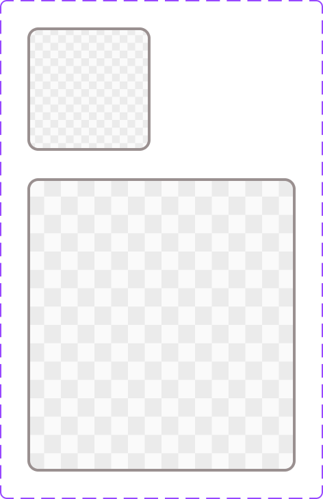

# Image

The **Image** component displays media content in predefined fixed-size variants.

## Overview

In Figma, this component is defined as a `COMPONENT_SET` (`Image`) with one variant property:

- `Size`: `90x90`, `196x214`

Source: [Image in Figma](https://www.figma.com/design/3hGC1ju0d5AKzaoI9pKIyu/PFB---Design-System?node-id=668-57)

### Visual Proof

- Screenshot: [Captured (2026-02-21)](https://figma-alpha-api.s3.us-west-2.amazonaws.com/images/01101c79-188d-4f72-9427-b7eec6d9d599)
- Source node: `668:57`
- Image hash: `11447eaade151d5687d198ef3f70234b9b100620406286e5e6fafaa040d54434`
- Variants captured: `2`

## Anatomy

<!-- AUTO-GENERATED-ANATOMY:START -->
Each image variant contains:

1. **Container** (`COMPONENT`)
2. **Image layer** (`RECTANGLE` with image fill)

<!-- AUTO-GENERATED-ANATOMY:END -->
## Component API

### Properties

<!-- AUTO-GENERATED-PROPERTIES:START -->
| Name | Type | Default | Required | Description |
| --- | --- | --- | --- | --- |
| `Size` | `VARIANT` | `90x90` | `true` | Size axis. Options: `90x90`, `196x214`. |

<!-- AUTO-GENERATED-PROPERTIES:END -->
## Visual Specifications

### Container

- Variant `Size=90x90`: `90 x 90`
- Variant `Size=196x214`: `196 x 214`
- Layout: `NONE`

### Token Mapping

| Part | Condition | Token | Fallback |
| --- | --- | --- | --- |
| `image_layer.fill` | `size=90x90` | `TBD` | `TBD` |
| `image_layer.fill` | `size=196x214` | `TBD` | `TBD` |

## Variants

<!-- AUTO-GENERATED-VARIANTS:START -->
| Variant | Differentiating token(s) | Fallback value(s) | Visual indicator |
| --- | --- | --- | --- |
| `Size=90x90` | `TBD` | `TBD` | Compact square image slot. |
| `Size=196x214` | `TBD` | `TBD` | Larger rectangular image slot. |

<!-- AUTO-GENERATED-VARIANTS:END -->
## States

This component has no interactive states in the current Figma definition.

## Usage Guidelines

### Behavior

- **When to use**: Use predefined image slots where fixed dimensions are required.
- **When not to use**: Do not use as an interactive control without explicit interaction design.
- **Do**: Keep source asset ratio aligned with chosen size variant.
- **Don't**: Stretch assets to fit incompatible dimensions.
- Responsive behavior: `TBD`
- Overflow / truncation behavior: `TBD`
- i18n / RTL behavior: `TBD`

### Examples

- Basic example: `Size=90x90` for compact image slots in lists/cards.
- Contextual example: `Size=196x214` for larger media blocks.

## Content Guidelines

- Prefer assets with adequate resolution for the target variant.
- Avoid embedding critical text into image content.

## Accessibility

### 1. ARIA role and semantics

- Expected semantic role: `img`.
- Decorative images should use decorative treatment.
- Informative images should provide meaningful alternative text.

### 2. Keyboard navigation

This component is not keyboard-interactive by itself.

### 3. Focus management

- No focus behavior is defined in the current Figma component.
- Focus behavior for interactive wrappers is `TBD`.

### 4. Labeling

- Informative usage requires descriptive alternative text.
- Decorative usage should avoid redundant announcements.

### 5. Contrast and visibility

- Contrast validation for image content is context-dependent (`TBD`).

## Related Components

- [Avatar](avatar.md): Use Avatar for profile representation with fixed square framing.
- [Topbar](topbar.md): Topbar may include image/media context but serves a different purpose.

## Gaps / TBD

- [ ] [SCHEMA_TBD] `token_mapping.image_layer.fill.size=196x214` is `TBD`. Specification value is unresolved.
- [ ] [SCHEMA_TBD] `token_mapping.image_layer.fill.size=90x90` is `TBD`. Specification value is unresolved.
