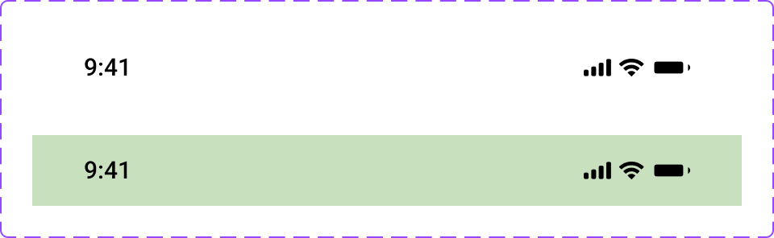

# Status Bar

The **Status Bar** component represents the top system status row for iPhone layouts.

## Overview

In Figma, this component is defined as a `COMPONENT_SET` (`Status-Bar`) with one variant property:

- `Background`: `Transparent`, `Brand`

Default variant in Figma: `Background=Transparent`.

All variants share the same structure and dimensions (`440 x 44`).

Source: [Status-Bar in Figma](https://www.figma.com/design/3hGC1ju0d5AKzaoI9pKIyu/PFB---Design-System?node-id=713-202)

### Visual Proof

- Screenshot: [Captured (2026-02-21)](https://figma-alpha-api.s3.us-west-2.amazonaws.com/images/115dcd4a-aee0-4bd1-9626-0736b7a66898)
- Source node: `713:202`
- Image hash: `4576067bbd9b29573dcb4a2fc69ffc4217c9a84472a58feeaadd91197ec4c639`
- Variants captured: `2`

## Anatomy

<!-- AUTO-GENERATED-ANATOMY:START -->
Each status bar contains:

1. **Container** (`COMPONENT`, `440 x 44`)
2. **OS row** (`FRAME`, `376 x 18`) positioned at `x=32`, `y=13`
3. **Time group** with text `9:41`
4. **Icons row** (`FRAME`, horizontal) with:
   - `Cellular Connection` (`VECTOR`)
   - `Wifi` (`VECTOR`)
   - `Battery` (`VECTOR`)

<!-- AUTO-GENERATED-ANATOMY:END -->
## Component API

### Properties

<!-- AUTO-GENERATED-PROPERTIES:START -->
| Name         | Type      | Default       | Required | Description                                        |
| ------------ | --------- | ------------- | -------- | -------------------------------------------------- |
| `Background` | `VARIANT` | `Transparent` | `true`   | Background style. Options: `Transparent`, `Brand`. |

<!-- AUTO-GENERATED-PROPERTIES:END -->
## Visual Specifications

### Container

- **Variant size**: `440 x 44`
- **Layout**: `NONE` (no Auto Layout at root)
- **Clips content**: `true`
- **Border**: none
- **Corner radius**: `0`

### OS Row

- **Node**: `FRAME`
- **Size**: `376 x 18`
- **Layout**: Auto Layout, `HORIZONTAL`
- **Item spacing**: `229`
- **Children**:
  - Left: time label (`9:41`)
  - Right: icons frame (`65.98 x 11`, Auto Layout `HORIZONTAL`, spacing `5`)

### Typography

- **Time text**: `9:41`
- **Font**: `Roboto Medium`
- **Size**: `15`
- **Line height**: `AUTO`
- **Letter spacing**: `0%`

### Iconography

- **Icons**: `Cellular Connection`, `Wifi`, `Battery`
- **Icons color token**: `Color/BW/Black`
- **Icons fallback**: `#000000`

### Token Mapping

| Part                   | Condition          | Token                              | Fallback  |
| ---------------------- | ------------------ | ---------------------------------- | --------- |
| `container.background` | `Background=Brand` | `Color/Background/Brand/Secondary` | `#C9E0BE` |
| `time_group.color`     | all variants       | `Color/BW/Black`                   | `#000000` |
| `icons_row.color`      | all variants       | `Color/BW/Black`                   | `#000000` |

## Variants

<!-- AUTO-GENERATED-VARIANTS:START -->
| Variant                  | Differentiating token(s)           | Fallback value(s) | Visual indicator             |
| ------------------------ | ---------------------------------- | ----------------- | ---------------------------- |
| `Background=Transparent` | `—`                                | `Transparent`     | No background fill           |
| `Background=Brand`       | `Color/Background/Brand/Secondary` | `#C9E0BE`         | Brand secondary surface fill |

<!-- AUTO-GENERATED-VARIANTS:END -->
## States

This component has no interactive states.

## Usage Guidelines

- **When to use**: Use at the top edge of iPhone-oriented mockups and mobile layout compositions.
- **When not to use**: Do not use as an interactive toolbar or as a content container.
- **Do**: Keep internal layout structure unchanged (time left, icons right).
- **Do**: Use `Background=Transparent` or `Background=Brand` according to the parent surface.
- **Don't**: Override icon/time color without validating contrast.
- **Don't**: Treat this component as a replacement for app-level navigation.

## Content Guidelines

This component has no user-authored text content. Time/system indicators are system-driven.

## Accessibility

### 1. ARIA role and semantics

- In most documentation/prototype contexts, this component is decorative system chrome.
- If rendered in product UI, semantic treatment is `TBD` and should follow platform conventions.
- Required ARIA attributes are `TBD`.

### 2. Keyboard navigation

This component is not keyboard-interactive.

### 3. Focus management

- No focus behavior is defined in Figma.
- Focus outline tokens are not applicable unless this component becomes interactive (`TBD`).

### 4. Labeling

- If status data is meaningful for assistive tech, provide equivalent accessible text outside this visual component.
- Labeling strategy for implementation is `TBD`.

### 5. Contrast and visibility

- Time and icon foreground should remain visible against both transparent and brand backgrounds.
- Contrast verification is `TBD (pending audit)`.

## Related Components

- [Bottom Bar](bottom_bar.md): Use as complementary bottom navigation in mobile page chrome.
- [Alert](alert.md): Use for contextual feedback content, not for fixed device chrome.

## Gaps / TBD

- [ ] [TOKEN_INVALID] `token_mapping.container.background.Background=Brand` references `Color/Background/Brand/Secondary` but it is missing in token registry.
- [ ] [TOKEN_INVALID] `token_mapping.icons_row.color.default` references `Color/BW/Black` but it is missing in token registry.
- [ ] [TOKEN_INVALID] `token_mapping.time_group.color.default` references `Color/BW/Black` but it is missing in token registry.
- [ ] [A11Y_TBD] `accessibility.role` is `TBD`. Accessibility detail is unresolved.
