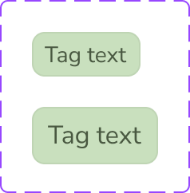

# Tag

The **Tag** component displays a short categorical label in a compact bordered container.

## Overview

In Figma, this component is defined as a `COMPONENT_SET` (`Tag`) with:

- `Size` variant: `Small`, `Medium`
- `Tag-Text` text property for label content

Source: [Tag in Figma](https://www.figma.com/design/3hGC1ju0d5AKzaoI9pKIyu/PFB---Design-System?node-id=2018-271)

### Visual Proof

- Screenshot: [Captured (2026-02-21)](https://figma-alpha-api.s3.us-west-2.amazonaws.com/images/ad4e2762-f396-4f1d-962c-08570abc2741)
- Source node: `2018:271`
- Image hash: `a0606bfd668098805a7f174fb2990569848959eab0bb2a2d88506ae612547cac`
- Variants captured: `2`
- Artifact: `../_generated/visual-proofs/tag.json`

## Anatomy

<!-- AUTO-GENERATED-ANATOMY:START -->
1. **Container** (`COMPONENT`): rounded shape with stroke and fill.
2. **Label text** (`TEXT`): single-line label controlled by `Tag-Text`.

<!-- AUTO-GENERATED-ANATOMY:END -->
## Component API

### Properties

<!-- AUTO-GENERATED-PROPERTIES:START -->
| Name | Type | Default | Required | Description |
| --- | --- | --- | --- | --- |
| `Size` | `VARIANT` | `Small` | `true` | Controls dimensions, paddings, and typography scale. |
| `Tag-Text` | `TEXT` | `Tag text` | `false` | Overrides the visible label string. |

<!-- AUTO-GENERATED-PROPERTIES:END -->
## Visual Specifications

### Container

- `Size=Small`: `68 x 28`, horizontal layout, padding `4 / 8 / 4 / 8`, corner radius `8`.
- `Size=Medium`: `79 x 36`, horizontal layout, padding `6 / 10 / 6 / 10`, corner radius `8`.
- Root component set clips content.

### Typography

- Small label frame: `52 x 20`.
- Medium label frame: `59 x 24`.

### Token Mapping

| Part | Condition | Token | Fallback |
| --- | --- | --- | --- |
| `container.background` | `size=Small` | `TBD` | `TBD` |
| `container.background` | `size=Medium` | `TBD` | `TBD` |
| `container.border-color` | `size=Small` | `TBD` | `TBD` |
| `container.border-color` | `size=Medium` | `TBD` | `TBD` |
| `container.border-radius` | `default` | `TBD` | `TBD` |
| `container.padding-horizontal` | `size=Small` | `TBD` | `TBD` |
| `container.padding-horizontal` | `size=Medium` | `TBD` | `TBD` |
| `container.padding-vertical` | `size=Small` | `TBD` | `TBD` |
| `container.padding-vertical` | `size=Medium` | `TBD` | `TBD` |
| `label_text.color` | `size=Small` | `TBD` | `TBD` |
| `label_text.color` | `size=Medium` | `TBD` | `TBD` |
| `label_text.typography` | `size=Small` | `TBD` | `TBD` |
| `label_text.typography` | `size=Medium` | `TBD` | `TBD` |

## Variants

<!-- AUTO-GENERATED-VARIANTS:START -->
| Variant | Differentiating token(s) | Fallback value(s) | Visual indicator |
| --- | --- | --- | --- |
| `Size=Small` | `TBD` | `TBD` | Compact tag with smaller text and padding. |
| `Size=Medium` | `TBD` | `TBD` | Taller tag with larger vertical rhythm. |

<!-- AUTO-GENERATED-VARIANTS:END -->
## States

This component has no interactive states in the current Figma definition.

## Usage Guidelines

### Behavior

- **When to use**: Display concise metadata labels that should remain scannable.
- **When not to use**: Avoid using Tag as the primary action affordance.
- **Do**: Keep labels short and taxonomy-consistent.
- **Don't**: Use long content that breaks compact layout.
- Responsive behavior: `TBD`
- Overflow / truncation behavior: `TBD`
- i18n / RTL behavior: `TBD`

### Examples

- Basic example: one category label in compact list metadata.
- Contextual example: multiple tags composed through `Tags-List`.

## Content Guidelines

- Prefer one to three words per tag.
- Use sentence case unless product taxonomy requires another convention.

## Accessibility

### 1. ARIA role and semantics

- Semantic role for standalone usage is `TBD`.
- For interactive wrappers, semantics depend on the wrapping control.

### 2. Keyboard navigation

This component is not keyboard-interactive by itself.

### 3. Focus management

- No internal focus behavior is defined in Figma.
- Focus behavior is delegated to interactive wrappers (`TBD`).

### 4. Labeling

- Exposed text should match the accessible name when wrapped interactively.
- Decorative-only usage should avoid redundant announcements.

### 5. Contrast and visibility

- Contrast targets are `TBD (pending audit)`.

## Related Components

- [Tags List](tags_list.md): Composes multiple Tag instances in one horizontal group.
- [Alert](alert.md): Uses a different semantic purpose (feedback vs metadata labeling).

## Gaps / TBD

- [ ] [SCHEMA_TBD] `token_mapping.container.background.size=Medium` is `TBD`. Specification value is unresolved.
- [ ] [SCHEMA_TBD] `token_mapping.container.background.size=Small` is `TBD`. Specification value is unresolved.
- [ ] [SCHEMA_TBD] `token_mapping.container.border-color.size=Medium` is `TBD`. Specification value is unresolved.
- [ ] [SCHEMA_TBD] `token_mapping.container.border-color.size=Small` is `TBD`. Specification value is unresolved.
- [ ] [SCHEMA_TBD] `token_mapping.container.border-radius.default` is `TBD`. Specification value is unresolved.
- [ ] [SCHEMA_TBD] `token_mapping.container.padding-horizontal.size=Medium` is `TBD`. Specification value is unresolved.
- [ ] [SCHEMA_TBD] `token_mapping.container.padding-horizontal.size=Small` is `TBD`. Specification value is unresolved.
- [ ] [SCHEMA_TBD] `token_mapping.container.padding-vertical.size=Medium` is `TBD`. Specification value is unresolved.
- [ ] [SCHEMA_TBD] `token_mapping.container.padding-vertical.size=Small` is `TBD`. Specification value is unresolved.
- [ ] [SCHEMA_TBD] `token_mapping.label_text.color.size=Medium` is `TBD`. Specification value is unresolved.
- [ ] [SCHEMA_TBD] `token_mapping.label_text.color.size=Small` is `TBD`. Specification value is unresolved.
- [ ] [SCHEMA_TBD] `token_mapping.label_text.typography.size=Medium` is `TBD`. Specification value is unresolved.
- [ ] [SCHEMA_TBD] `token_mapping.label_text.typography.size=Small` is `TBD`. Specification value is unresolved.
- [ ] [A11Y_TBD] `accessibility.role` is `TBD`. Accessibility detail is unresolved.
