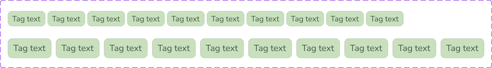

# Tags List

The **Tags List** component displays a horizontal sequence of tags with per-item visibility controls.

## Overview

In Figma, this component is defined as a `COMPONENT_SET` (`Tags-List`) with:

- `Size` variant: `Small`, `Medium`
- Boolean properties: `Show Tag_1` through `Show Tag_10`

Source: [Tags-List in Figma](https://www.figma.com/design/3hGC1ju0d5AKzaoI9pKIyu/PFB---Design-System?node-id=2075-295)

### Visual Proof

- Screenshot: [Captured (2026-02-21)](https://figma-alpha-api.s3.us-west-2.amazonaws.com/images/698f362e-939e-4b4d-90bc-cf338ede5f8b)
- Source node: `2075:295`
- Image hash: `ec14e7008802eb967a22af803ca6ef9871b84ac178b628473d3dd241184d807d`
- Variants captured: `2`
- Artifact: `../_generated/visual-proofs/tags_list.json`

## Anatomy

<!-- AUTO-GENERATED-ANATOMY:START -->
1. **Container** (`COMPONENT`): horizontal auto-layout wrapper.
2. **Tag item** (`INSTANCE`): repeated `Tag` components.
3. **Visibility controls** (`BOOLEAN` properties): toggle each slot independently.

<!-- AUTO-GENERATED-ANATOMY:END -->
## Component API

### Properties

<!-- AUTO-GENERATED-PROPERTIES:START -->
| Name | Type | Default | Required | Description |
| --- | --- | --- | --- | --- |
| `Size` | `VARIANT` | `Small` | `true` | Controls size variant and spacing for the list. |
| `Show Tag_1` | `BOOLEAN` | `true` | `false` | Toggles visibility of tag item 1. |
| `Show Tag_2` | `BOOLEAN` | `true` | `false` | Toggles visibility of tag item 2. |
| `Show Tag_3` | `BOOLEAN` | `true` | `false` | Toggles visibility of tag item 3. |
| `Show Tag_4` | `BOOLEAN` | `true` | `false` | Toggles visibility of tag item 4. |
| `Show Tag_5` | `BOOLEAN` | `true` | `false` | Toggles visibility of tag item 5. |
| `Show Tag_6` | `BOOLEAN` | `true` | `false` | Toggles visibility of tag item 6. |
| `Show Tag_7` | `BOOLEAN` | `true` | `false` | Toggles visibility of tag item 7. |
| `Show Tag_8` | `BOOLEAN` | `true` | `false` | Toggles visibility of tag item 8. |
| `Show Tag_9` | `BOOLEAN` | `true` | `false` | Toggles visibility of tag item 9. |
| `Show Tag_10` | `BOOLEAN` | `true` | `false` | Toggles visibility of tag item 10. |

<!-- AUTO-GENERATED-PROPERTIES:END -->
## Visual Specifications

### Container

- `Size=Small`: `716 x 28`, horizontal auto-layout, gap `4`.
- `Size=Medium`: `862 x 36`, horizontal auto-layout, gap `8`.
- Child count: up to ten Tag instances.

### Token Mapping

| Part | Condition | Token | Fallback |
| --- | --- | --- | --- |
| `container.gap` | `size=Small` | `TBD` | `TBD` |
| `container.gap` | `size=Medium` | `TBD` | `TBD` |
| `tag_item.typography` | `size=Small` | `TBD` | `TBD` |
| `tag_item.typography` | `size=Medium` | `TBD` | `TBD` |
| `tag_item.background` | `size=Small` | `TBD` | `TBD` |
| `tag_item.background` | `size=Medium` | `TBD` | `TBD` |
| `tag_item.border-color` | `size=Small` | `TBD` | `TBD` |
| `tag_item.border-color` | `size=Medium` | `TBD` | `TBD` |
| `tag_item.text-color` | `size=Small` | `TBD` | `TBD` |
| `tag_item.text-color` | `size=Medium` | `TBD` | `TBD` |

## Variants

<!-- AUTO-GENERATED-VARIANTS:START -->
| Variant | Differentiating token(s) | Fallback value(s) | Visual indicator |
| --- | --- | --- | --- |
| `Size=Small` | `TBD` | `TBD` | Dense row of compact tag items with 4px gap. |
| `Size=Medium` | `TBD` | `TBD` | Taller row with 8px spacing and larger tag instances. |

<!-- AUTO-GENERATED-VARIANTS:END -->
## States

This component has no internal interactive states in the current Figma definition.

## Usage Guidelines

### Behavior

- **When to use**: Present multiple related labels in one horizontal group.
- **When not to use**: Avoid for long lists requiring multi-line wrapping behavior not specified in Figma.
- **Do**: Use visibility toggles to show only relevant tags.
- **Don't**: Mix unrelated label taxonomies in one list.
- Responsive behavior: `TBD`
- Overflow / truncation behavior: `TBD`
- i18n / RTL behavior: `TBD`

### Examples

- Basic example: list of three metadata tags in a card header.
- Contextual example: up to ten tags in overview filters using consistent size variant.

## Content Guidelines

- Maintain a consistent order for visible tags.
- Keep labels short to preserve scanability in dense layouts.

## Accessibility

### 1. ARIA role and semantics

- Group semantic role is `TBD`.
- Item semantics are inherited from `Tag` wrappers in implementation.

### 2. Keyboard navigation

This component is not keyboard-interactive by itself.

### 3. Focus management

- No internal focus logic is defined in Figma.
- Focus behavior depends on wrapper semantics (`TBD`).

### 4. Labeling

- If tags are informative, surrounding context should provide group meaning.
- Accessible naming strategy for interactive usage is `TBD`.

### 5. Contrast and visibility

- Contrast verification is `TBD (pending audit)`.

## Related Components

- [Tag](tag.md): Base item component reused by each slot in the list.
- [Topbar](topbar.md): Can host filtered metadata regions that include tag groups.

## Gaps / TBD

- [ ] [SCHEMA_TBD] `token_mapping.container.gap.size=Medium` is `TBD`. Specification value is unresolved.
- [ ] [SCHEMA_TBD] `token_mapping.container.gap.size=Small` is `TBD`. Specification value is unresolved.
- [ ] [SCHEMA_TBD] `token_mapping.tag_item.background.size=Medium` is `TBD`. Specification value is unresolved.
- [ ] [SCHEMA_TBD] `token_mapping.tag_item.background.size=Small` is `TBD`. Specification value is unresolved.
- [ ] [SCHEMA_TBD] `token_mapping.tag_item.border-color.size=Medium` is `TBD`. Specification value is unresolved.
- [ ] [SCHEMA_TBD] `token_mapping.tag_item.border-color.size=Small` is `TBD`. Specification value is unresolved.
- [ ] [SCHEMA_TBD] `token_mapping.tag_item.text-color.size=Medium` is `TBD`. Specification value is unresolved.
- [ ] [SCHEMA_TBD] `token_mapping.tag_item.text-color.size=Small` is `TBD`. Specification value is unresolved.
- [ ] [SCHEMA_TBD] `token_mapping.tag_item.typography.size=Medium` is `TBD`. Specification value is unresolved.
- [ ] [SCHEMA_TBD] `token_mapping.tag_item.typography.size=Small` is `TBD`. Specification value is unresolved.
- [ ] [A11Y_TBD] `accessibility.role` is `TBD`. Accessibility detail is unresolved.
