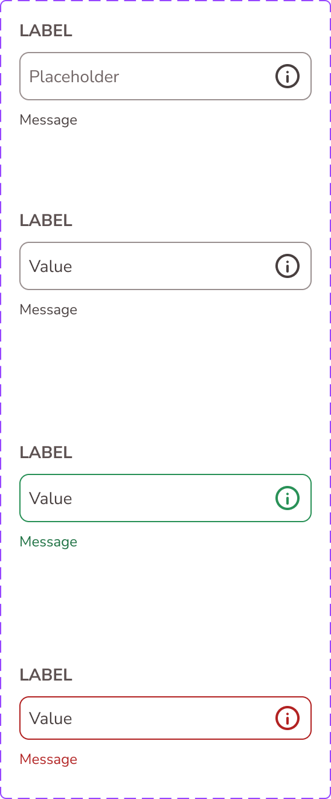

# Text Input

The **Text Input** component captures single-line textual data with optional label, icon, and support message.

## Overview

- Purpose: Capture short, single-line form input.
- Figma component set: `Text-Input`.
- Variant properties: `Type` with `Default`, `Filled`, `Success`, `Error`.
- Source: [Text-Input in Figma](https://www.figma.com/design/3hGC1ju0d5AKzaoI9pKIyu/PFB---Design-System?node-id=204-483&t=Ct0aRp93us7M1VzZ-4).

### Visual Proof

- Screenshot: [Captured (2026-02-21)](https://figma-alpha-api.s3.us-west-2.amazonaws.com/images/3401b15a-12ae-47e0-aa73-8e52669f7bfa)
- Source node: `204:483`
- Image hash: `770b100e74c938dba04ea05f4562fdc72703bb6f44498cbf4e0d3247c28995f1`
- Variants captured: `4`

## Anatomy

<!-- AUTO-GENERATED-ANATOMY:START -->
1. **Field container**: Main input surface and border.
2. **Label**: Optional text label.
3. **Value/Placeholder**: Content area text.
4. **Type icon**: Optional leading icon slot.
5. **Support message**: Optional validation/helper text.

<!-- AUTO-GENERATED-ANATOMY:END -->
## Component API

### Properties

<!-- AUTO-GENERATED-PROPERTIES:START -->
| Name | Type | Default | Required | Description |
| --- | --- | --- | --- | --- |
| `Type` | `VARIANT` | `Default` | `true` | Visual and semantic state of the input field. |
| `Change_Placeholder` | `TEXT` | `Placeholder` | `false` | Placeholder content. |
| `Change_Value` | `TEXT` | `Value` | `false` | Current value content. |
| `↳ Change_Label` | `TEXT` | `Label` | `false` | Label text override. |
| `↳ Change_Message` | `TEXT` | `Message` | `false` | Support message text override. |
| `Type-Icon` | `INSTANCE_SWAP` | `65:928` | `false` | Leading icon slot instance. |
| `Show_Icon` | `BOOLEAN` | `true` | `false` | Toggles icon visibility. |
| `Show_Message` | `BOOLEAN` | `true` | `false` | Toggles support message visibility. |
| `Show_message_layer` | `BOOLEAN` | `true` | `false` | Toggles message layer container visibility. |
| `Show_label` | `BOOLEAN` | `true` | `false` | Toggles label visibility. |

<!-- AUTO-GENERATED-PROPERTIES:END -->
## Visual Specifications

### Container

- Root type: `COMPONENT_SET` with four variants.
- Variant axis: `Type` (`Default`, `Filled`, `Success`, `Error`).
- Field surface, border, and spacing token mapping: `TBD`.
- Support message color token mapping: `TBD`.

### Typography

- Label/value/message typography tokens: `TBD`.
- Placeholder typography token: `TBD`.
- Text style names: `TBD`.

## Variants

<!-- AUTO-GENERATED-VARIANTS:START -->
| Variant | Token | Fallback | Notes |
| --- | --- | --- | --- |
| `Type=Default` | `TBD` | `TBD` | Neutral input state. |
| `Type=Filled` | `TBD` | `TBD` | Filled/value-present style. |
| `Type=Success` | `TBD` | `TBD` | Validation success style. |
| `Type=Error` | `TBD` | `TBD` | Validation error style. |

<!-- AUTO-GENERATED-VARIANTS:END -->
## States

- Default: `Type=Default`.
- Filled: `Type=Filled`.
- Success: `Type=Success`.
- Error: `Type=Error`.
- Hover/Focus/Pressed: `TBD` (not exposed as separate Figma variant axis).

## Usage Guidelines

### When to use

- Use for short input fields in forms (name, email, code, etc.).
- Use when a single-line field is sufficient.

### When not to use

- Do not use for multi-line responses.
- Do not rely on placeholder-only labeling.

### Behavior

- Interactions: Accepts single-line text input.
- Responsive behavior: `TBD`.
- Overflow/truncation: `TBD`.
- i18n/RTL: `TBD`.

### Examples

1. Basic: Default state with label and placeholder.
2. Contextual: Error state with support message after validation.

## Content Guidelines

- Use explicit labels and concise helper text.
- Keep validation feedback actionable and short.

## Accessibility

- ARIA: Use native textbox semantics (`input`), with associated label and describedby support text where applicable.
- Keyboard: Standard text-input keyboard behavior.
- Focus: `Semantic.Color.Focus-Outline.Inner` (`#FFFFFF`) and `Semantic.Color.Focus-Outline.Outer` (`#567680`).
- Labeling: Label must be programmatically associated with the input control.
- Hit area: `A11y.A11y.Dimension.Min-Hit-Area` (`24px`) and `Primitives.Dimension.A11y.Min-Hit-Area-Mobile-AAA` (`48px`).
- Contrast: Validation and text contrast values are `TBD (pending audit)`.

## Related Components

- [Text Area](text_area.md): Multi-line companion input.
- [Alert](alert.md): Validation feedback container in broader form flows.

## Gaps / TBD

- [ ] [SCHEMA_TBD] `token_mapping.field_container.background.default` is `TBD`. Specification value is unresolved.
- [ ] [SCHEMA_TBD] `token_mapping.support_message.color.error` is `TBD`. Specification value is unresolved.
