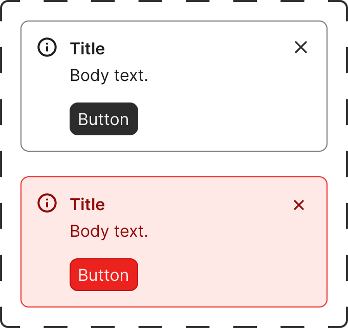

# Notification

The Notification component surfaces concise inline feedback with optional icon, dismiss control, and action area.

## Overview

- Purpose: Show message or alert feedback in a compact inline block.
- Figma component set: `Notification` (`124:8256`)
- Variant properties: `Variant`

### Visual Proof

- Screenshot: [Captured (2026-02-23)](https://figma-alpha-api.s3.us-west-2.amazonaws.com/images/be5cb0f7-7ddf-414b-a1fc-0c04dcdc1e5d)
- Source node: `124:8256`
- Artifact: `../_generated/visual-proofs/notification.json`

## Anatomy

1. **Container**: Root feedback container with border and internal spacing.
2. **Leading icon**: Optional semantic icon region.
3. **Title text**: Optional title line.
4. **Body text**: Main message content.
5. **Dismiss action**: Optional dismiss control.
6. **Secondary action**: Optional button/action area.

## Component API

### Properties

| Name          | Type            | Default      | Required | Description                                     |
| ------------- | --------------- | ------------ | -------- | ----------------------------------------------- |
| `Variant`     | `VARIANT`       | `Message`    | `true`   | Controls semantic variant and visual treatment. |
| `Title`       | `TEXT`          | `Title`      | `false`  | Overrides the title copy.                       |
| `Body`        | `TEXT`          | `Body text.` | `true`   | Main body message content.                      |
| `Dismissible` | `BOOLEAN`       | `true`       | `false`  | Shows or hides dismiss control.                 |
| `Has Icon`    | `BOOLEAN`       | `true`       | `false`  | Shows or hides the leading icon.                |
| `Has Button`  | `BOOLEAN`       | `true`       | `false`  | Shows or hides the optional action button area. |
| `Icon`        | `INSTANCE_SWAP` | `Info`       | `false`  | Swaps the leading icon instance.                |

## Visual Specifications

### Container

- Layout: `TBD`
- Spacing: `TBD`
- Border/background tokens: `TBD`

### Typography

- Title style: `TBD`
- Body style: `TBD`

## Variants

| Variant   | Token | Fallback | Notes                           |
| --------- | ----- | -------- | ------------------------------- |
| `Message` | `TBD` | `TBD`    | Default inline feedback style.  |
| `Alert`   | `TBD` | `TBD`    | Higher-emphasis feedback style. |

## States

- Default: Base presentation controlled by `Variant`.
- Dismissible off: Dismiss control hidden.
- Icon off: Leading icon hidden.
- Button off: Secondary action hidden.

## Usage Guidelines

### When to use

- Inline status feedback near related content.
- Short system confirmations, warnings, or neutral notices.

### When not to use

- Long instructional content.
- Modal or blocking flows.

### Behavior

- Dismiss behavior and side effects: `TBD`
- Action button behavior: `TBD`

### Examples

1. Message notice with icon and dismiss.
2. Alert notice with action button.

## Content Guidelines

- Keep title short and scannable.
- Keep body copy concise and actionable.
- Ensure message is understandable without relying only on color/icon.

## Accessibility

- Role: `alert`
- Focus outline tokens for interactive controls: see component spec token mapping.
- Hit area tokens: see component spec accessibility hit-area tokens.
- Labeling:
  - Dismiss and action controls must have clear accessible names.

## Related Components

- [Alert](alert.md): Use for closely related feedback patterns.

## Gaps / TBD

- [ ] [SCHEMA_TBD] `token_mapping.body_text.color.default` is `TBD`. Specification value is unresolved.
- [ ] [SCHEMA_TBD] `token_mapping.container.background.variant=Alert` is `TBD`. Specification value is unresolved.
- [ ] [SCHEMA_TBD] `token_mapping.container.background.variant=Message` is `TBD`. Specification value is unresolved.
- [ ] [SCHEMA_TBD] `token_mapping.container.border.variant=Alert` is `TBD`. Specification value is unresolved.
- [ ] [SCHEMA_TBD] `token_mapping.container.border.variant=Message` is `TBD`. Specification value is unresolved.
- [ ] [SCHEMA_TBD] `token_mapping.leading_icon.color.variant=Alert` is `TBD`. Specification value is unresolved.
- [ ] [SCHEMA_TBD] `token_mapping.leading_icon.color.variant=Message` is `TBD`. Specification value is unresolved.
- [ ] [SCHEMA_TBD] `token_mapping.title_text.color.default` is `TBD`. Specification value is unresolved.
