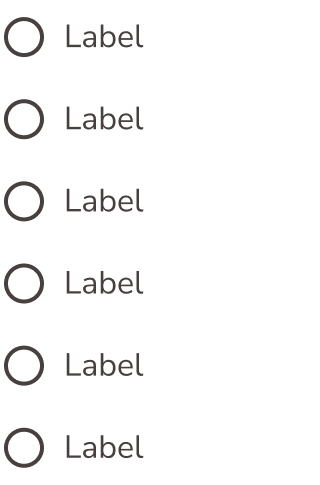

# Radio Button List

The **Radio Button List** component groups multiple labeled radio options into one exclusive-choice set.

## Overview

- Purpose: Present a set of mutually exclusive options with labels.
- Figma component: `Radio-Button-List`.
- Exposed properties: `Show_Radio_Button_Label_1` through `Show_Radio_Button_Label_6`.
- Source: [Radio-Button-List in Figma](https://www.figma.com/design/3hGC1ju0d5AKzaoI9pKIyu/PFB---Design-System?node-id=2335-2158&t=Ct0aRp93us7M1VzZ-4).

### Visual Proof

- Screenshot: [Captured (2026-02-23)](https://figma-alpha-api.s3.us-west-2.amazonaws.com/images/a6587aa2-db60-4055-8a67-2e4255feffdc)
- Source node: `2335:2158`
- Image hash: `823a81c34cc75f93e667530ce4b922f7b52152019c29e02f723256afd36a9aba`
- Variants captured: `1`
- Artifact: `../_generated/visual-proofs/radio_button_list.json`

## Anatomy

1. **Radio-Button-Label** — Width 160, Height 37, Border weight 1, Instance of Radio-Button-Label
2. **Radio-Button-Label** — Width 160, Height 37, Border weight 1, Instance of Radio-Button-Label
3. **Radio-Button-Label** — Width 160, Height 37, Border weight 1, Instance of Radio-Button-Label
4. **Radio-Button-Label** — Width 160, Height 37, Border weight 1, Instance of Radio-Button-Label
5. **Radio-Button-Label** — Width 160, Height 37, Border weight 1, Instance of Radio-Button-Label
6. **Radio-Button-Label** — Width 160, Height 37, Border weight 1, Instance of Radio-Button-Label

## Component API

### Properties

| Name | Type | Default | Required | Description |
| --- | --- | --- | --- | --- |
| Show_Radio_Button_Label_1#2335:49 | BOOLEAN | true | false | Boolean toggle. |
| Show_Radio_Button_Label_2#2335:50 | BOOLEAN | true | false | Boolean toggle. |
| Show_Radio_Button_Label_3#2335:51 | BOOLEAN | true | false | Boolean toggle. |
| Show_Radio_Button_Label_4#2335:52 | BOOLEAN | true | false | Boolean toggle. |
| Show_Radio_Button_Label_5#2335:53 | BOOLEAN | true | false | Boolean toggle. |
| Show_Radio_Button_Label_6#2335:54 | BOOLEAN | true | false | Boolean toggle. |

## Visual Specifications

### Per-variant attributes

- `TBD`

### Layout and spacing

Auto-layout tree describing direction, alignment, resizing, spacing, and padding for each node.

| Node | Direction | Alignment | H Sizing | V Sizing | Item Spacing | Padding (T/R/B/L) |
| --- | --- | --- | --- | --- | --- | --- |
| container | Vertical | Top top | Fixed | Fixed | 4 | — |
| radiobuttonlabel | Horizontal | Center top | Fixed | Fixed | 8 | — |
| radiobutton | Horizontal | Center center | Fixed | Fixed | 10 | 4/4/4/4 |
| radio_button_label | Horizontal | Center top | Fixed | Fixed | 8 | — |
| radiobuttonlabel | Horizontal | Center top | Fixed | Fixed | 8 | — |
| radiobutton | Horizontal | Center center | Fixed | Fixed | 10 | 4/4/4/4 |
| radio_button_label | Horizontal | Center top | Fixed | Fixed | 8 | — |
| radiobuttonlabel | Horizontal | Center top | Fixed | Fixed | 8 | — |
| radiobutton | Horizontal | Center center | Fixed | Fixed | 10 | 4/4/4/4 |
| radio_button_label | Horizontal | Center top | Fixed | Fixed | 8 | — |
| radiobuttonlabel | Horizontal | Center top | Fixed | Fixed | 8 | — |
| radiobutton | Horizontal | Center center | Fixed | Fixed | 10 | 4/4/4/4 |
| radio_button_label | Horizontal | Center top | Fixed | Fixed | 8 | — |
| radiobuttonlabel | Horizontal | Center top | Fixed | Fixed | 8 | — |
| radiobutton | Horizontal | Center center | Fixed | Fixed | 10 | 4/4/4/4 |
| radio_button_label | Horizontal | Center top | Fixed | Fixed | 8 | — |
| radiobuttonlabel | Horizontal | Center top | Fixed | Fixed | 8 | — |
| radiobutton | Horizontal | Center center | Fixed | Fixed | 10 | 4/4/4/4 |
| radio_button_label | Horizontal | Center top | Fixed | Fixed | 8 | — |

## Variants

| Variant | Token | Fallback | Notes |
| --- | --- | --- | --- |
| `N/A` | `TBD` | `TBD` | No variant axis; configuration is driven by option visibility booleans. |

## States

- Default: All option toggles `true` in source component.
- Checked state behavior is delegated to nested radio controls.
- Disabled / Hover / Focus / Pressed: `TBD` at list container level.

## Usage Guidelines

### When to use

- Use for single-choice option groups.
- Use where labels must clearly describe each option.

### When not to use

- Do not use for multi-select choice sets.
- Do not use where options are unordered or independent.

### Behavior

- Interactions: Selecting one option should unselect any previously selected option.
- Responsive behavior: `TBD`.
- Overflow/truncation: `TBD`.
- i18n/RTL: `TBD`.

### Examples

1. Basic: 3-option preference selector.
2. Contextual: Form section with dynamic number of visible options.

## Content Guidelines

- Keep labels unique and concise.
- Keep option ordering stable for comprehension.

## Accessibility

- ARIA: Group should expose radiogroup semantics in implementation.
- Keyboard: Roving focus and arrow-key behavior are implementation-defined.
- Focus: `Semantic.Color.Focus-Outline.Inner` (`#FFFFFF`) and `Semantic.Color.Focus-Outline.Outer` (`#567680`).
- Labeling: Group-level label semantics are `TBD`.
- Hit area: `A11y.A11y.Dimension.Min-Hit-Area` (`24px`) and `Primitives.Dimension.A11y.Min-Hit-Area-Mobile-AAA` (`48px`).
- Contrast: Option text and control contrast values are `TBD (pending audit)`.

## Related Components

- [Radio Button](radio_button.md): Base control for exclusive selection.
- [Radio Button Label](radio_button_label.md): Labeled option row used in this list.

## Gaps / TBD

- [ ] [SCHEMA_TBD] `token_mapping.list_container.gap.default` is `TBD`. Specification value is unresolved.
- [ ] [SCHEMA_TBD] `token_mapping.option_item.text_color.default` is `TBD`. Specification value is unresolved.
