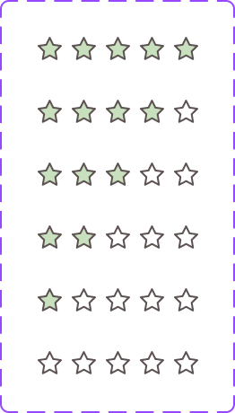

# Rating Stars

The **Rating Stars** component is documented from Figma component-set metadata and pending token-level verification.

## Overview

In Figma, this component is defined as a `COMPONENT_SET` (`Rating_Stars`) with the following properties:

- `Stars_Number`: `5`, `4`, `3`, `1`, `2`, `0`

Source: [Rating_Stars in Figma](https://www.figma.com/design/3hGC1ju0d5AKzaoI9pKIyu/PFB---Design-System?node-id=683-264)

### Visual Proof

- Screenshot: [Captured (2026-02-23)](https://figma-alpha-api.s3.us-west-2.amazonaws.com/images/d5486242-e529-4e7a-8607-3694623caa21)
- Source node: `683:264`
- Image hash: `05213c92901a17f60b393bcde38d9f8edc7975c179754fa9c4b64b4fb7f11a29`
- Variants captured: `6`
- Artifact: `../_generated/visual-proofs/rating_stars.json`

## Anatomy

1. **Star** — Width 15, Height 15, Border weight 1, Aspect ratio 1:1, Instance of Star
2. **Star** — Width 15, Height 15, Border weight 1, Aspect ratio 1:1, Instance of Star
3. **Star** — Width 15, Height 15, Border weight 1, Aspect ratio 1:1, Instance of Star
4. **Star** — Width 15, Height 15, Border weight 1, Aspect ratio 1:1, Instance of Star
5. **Star** — Width 15, Height 15, Border weight 1, Aspect ratio 1:1, Instance of Star

## Component API

### Properties

| Name | Type | Default | Required | Description |
| --- | --- | --- | --- | --- |
| Stars_Number | VARIANT | 5 | true | Variant selector. |

## Visual Specifications

### Per-variant attributes

#### Stars_Number=0

- **star_icon**: Stroke `#5D5252`
- **star_icon_2**: Stroke `#5D5252`
- **star_icon_3**: Stroke `#5D5252`
- **star_icon_4**: Stroke `#5D5252`
- **star_icon_5**: Stroke `#5D5252`

#### Stars_Number=1

- **star_icon**: Background `#C9E0BE`, Stroke `#5D5252`
- **star_icon_2**: Stroke `#5D5252`
- **star_icon_3**: Stroke `#5D5252`
- **star_icon_4**: Stroke `#5D5252`
- **star_icon_5**: Stroke `#5D5252`

#### Stars_Number=2

- **star_icon**: Background `#C9E0BE`, Stroke `#5D5252`
- **star_icon_2**: Background `#C9E0BE`, Stroke `#5D5252`
- **star_icon_3**: Stroke `#5D5252`
- **star_icon_4**: Stroke `#5D5252`
- **star_icon_5**: Stroke `#5D5252`

#### Stars_Number=3

- **star_icon**: Background `#C9E0BE`, Stroke `#5D5252`
- **star_icon_2**: Background `#C9E0BE`, Stroke `#5D5252`
- **star_icon_3**: Background `#C9E0BE`, Stroke `#5D5252`
- **star_icon_4**: Stroke `#5D5252`
- **star_icon_5**: Stroke `#5D5252`

#### Stars_Number=4

- **star_icon**: Background `#C9E0BE`, Stroke `#5D5252`
- **star_icon_2**: Background `#C9E0BE`, Stroke `#5D5252`
- **star_icon_3**: Background `#C9E0BE`, Stroke `#5D5252`
- **star_icon_4**: Background `#C9E0BE`, Stroke `#5D5252`
- **star_icon_5**: Stroke `#5D5252`

#### Stars_Number=5

- **star_icon**: Background `#C9E0BE`, Stroke `#5D5252`
- **star_icon_2**: Background `#C9E0BE`, Stroke `#5D5252`
- **star_icon_3**: Background `#C9E0BE`, Stroke `#5D5252`
- **star_icon_4**: Background `#C9E0BE`, Stroke `#5D5252`
- **star_icon_5**: Background `#C9E0BE`, Stroke `#5D5252`

### Layout and spacing

Auto-layout tree describing direction, alignment, resizing, spacing, and padding for each node.

| Node | Direction | Alignment | H Sizing | V Sizing | Item Spacing | Padding (T/R/B/L) |
| --- | --- | --- | --- | --- | --- | --- |
| container | Horizontal | Top top | Fixed | Fixed | 4 | — |
| star | Horizontal | Top top | Fixed | Fixed | 0 | — |
| star | Horizontal | Top top | Fixed | Fixed | 0 | — |
| star | Horizontal | Top top | Fixed | Fixed | 0 | — |
| star | Horizontal | Top top | Fixed | Fixed | 0 | — |
| star | Horizontal | Top top | Fixed | Fixed | 0 | — |

## Variants

| Variant | Differentiating token(s) | Fallback value(s) | Visual indicator |
| --- | --- | --- | --- |
| `Stars_Number=5` | `TBD` | `TBD` | Variant captured from Figma property `Stars_Number`. |
| `Stars_Number=4` | `TBD` | `TBD` | Variant captured from Figma property `Stars_Number`. |
| `Stars_Number=3` | `TBD` | `TBD` | Variant captured from Figma property `Stars_Number`. |
| `Stars_Number=1` | `TBD` | `TBD` | Variant captured from Figma property `Stars_Number`. |
| `Stars_Number=2` | `TBD` | `TBD` | Variant captured from Figma property `Stars_Number`. |
| `Stars_Number=0` | `TBD` | `TBD` | Variant captured from Figma property `Stars_Number`. |

## States

This component has no interactive states in the current Figma definition.

## Usage Guidelines

### Behavior

- **When to use**: Use Rating Stars when this pattern is needed in the interface and matches its Figma variants.
- **When not to use**: Do not use Rating Stars for scenarios not represented by its current variant/property contract.
- **Do**: Use the variant and property contract exactly as defined in Figma. Validate visual behavior before promoting to ready status.
- **Don't**: Do not overload this component with semantics it was not designed for. Do not hardcode colors or spacing outside the token system.
- Responsive behavior: `TBD`
- Overflow / truncation behavior: `TBD`
- i18n / RTL behavior: `TBD`

### Examples

- Basic example: use the default variant in its target layout.
- Contextual example: compose this component inside its parent pattern.

## Content Guidelines

- Keep content concise and aligned with product voice.
- Do not exceed space available in the default variant without overflow handling.

## Accessibility

### 1. ARIA role and semantics

- Role: `TBD`.

### 2. Keyboard navigation

- Keyboard behavior is `TBD` pending interaction audit.

### 3. Focus management

- Inner focus token: `TBD`.
- Outer focus token: `TBD`.

### 4. Labeling

- Provide an accessible name when interactive.
- Avoid redundant announcements for decorative content.

### 5. Contrast and visibility

- Contrast requirements are `TBD (pending audit)`.

## Related Components

- `TBD`

## Gaps / TBD

- [ ] [SCHEMA_TBD] `token_mapping.container.background.stars_number=0` is `TBD`. Specification value is unresolved.
- [ ] [SCHEMA_TBD] `token_mapping.container.background.stars_number=1` is `TBD`. Specification value is unresolved.
- [ ] [SCHEMA_TBD] `token_mapping.container.background.stars_number=2` is `TBD`. Specification value is unresolved.
- [ ] [SCHEMA_TBD] `token_mapping.container.background.stars_number=3` is `TBD`. Specification value is unresolved.
- [ ] [SCHEMA_TBD] `token_mapping.container.background.stars_number=4` is `TBD`. Specification value is unresolved.
- [ ] [SCHEMA_TBD] `token_mapping.container.background.stars_number=5` is `TBD`. Specification value is unresolved.
- [ ] [A11Y_TBD] `accessibility.role` is `TBD`. Accessibility detail is unresolved.
