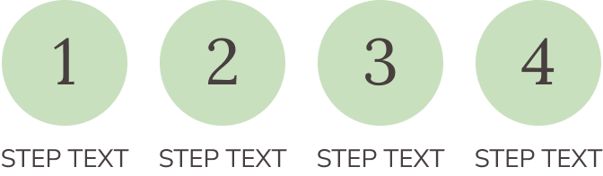

# Stepper

The **Stepper** component arranges multiple Step items to communicate linear process progress.

## Overview

- Purpose: Show ordered progress through a multi-step workflow.
- Figma component: `Stepper`.
- Exposed properties: `Show_Step_1` to `Show_Step_4`.
- Source: [Stepper in Figma](https://www.figma.com/design/3hGC1ju0d5AKzaoI9pKIyu/PFB---Design-System?node-id=2282-1820&t=Ct0aRp93us7M1VzZ-).

### Visual Proof

- Screenshot: [Captured (2026-02-23)](https://figma-alpha-api.s3.us-west-2.amazonaws.com/images/deb0e6de-b94c-4fcd-a15a-f529cd50db80)
- Source node: `2282:1820`
- Image hash: `44275e7909b59c1a1be31a10419f1c356f400442b8a38ff5ae46ed1978b79f4d`
- Variants captured: `1`
- Artifact: `../_generated/visual-proofs/stepper.json`

## Anatomy

1. **Stepper container**: Wrapper frame for step items.
2. **Step item instances**: Repeated `Step` components.
3. **Visibility toggles**: Boolean properties controlling each step slot.

## Component API

### Properties

| Name | Type | Default | Required | Description |
| --- | --- | --- | --- | --- |
| `Show_Step_1` | `BOOLEAN` | `true` | `false` | Toggles visibility of step 1. |
| `Show_Step_2` | `BOOLEAN` | `true` | `false` | Toggles visibility of step 2. |
| `Show_Step_3` | `BOOLEAN` | `true` | `false` | Toggles visibility of step 3. |
| `Show_Step_4` | `BOOLEAN` | `true` | `false` | Toggles visibility of step 4. |

## Visual Specifications

### Container

- Component wrapper with repeated Step instances.
- Container spacing and connector token mapping: `TBD`.

### Typography

- Inherited from nested `Step` instances.
- Step label typography mapping: `TBD`.

## Variants

| Variant | Token | Fallback | Notes |
| --- | --- | --- | --- |
| `N/A` | `TBD` | `TBD` | No variant axis; behavior configured via visibility booleans. |

## States

- Default: All step toggles are `true` in source component.
- Active state is delegated to nested `Step` instances.
- Disabled / Hover / Focus / Pressed: `TBD` at container level.

## Usage Guidelines

### When to use

- Use for linear, ordered multi-step workflows.
- Use when current progress must be visible at a glance.

### When not to use

- Do not use for unordered lists.
- Do not use when steps are not user-visible milestones.

### Behavior

- Interactions: Step visibility is controlled via boolean properties.
- Responsive behavior: `TBD`.
- Overflow/truncation: `TBD`.
- i18n/RTL: `TBD`.

### Examples

1. Basic: 4-step process with all steps visible.
2. Contextual: 3-step process by hiding one slot.

## Content Guidelines

- Keep step labels short and parallel.
- Preserve stable ordering of steps across screens.

## Accessibility

- ARIA: Container generally maps to list/progress semantics in implementation.
- Keyboard: Navigation behavior is implementation-dependent and `TBD`.
- Focus: `Semantic.Color.Focus-Outline.Inner` (`#FFFFFF`) and `Semantic.Color.Focus-Outline.Outer` (`#567680`).
- Labeling: Group label and current-step announcement are `TBD`.
- Hit area: `A11y.A11y.Dimension.Min-Hit-Area` (`24px`) and `Primitives.Dimension.A11y.Min-Hit-Area-Mobile-AAA` (`48px`).
- Contrast: Visual connector and marker contrast are `TBD (pending audit)`.

## Related Components

- [Step](step.md): Base step item used by Stepper.
- [Topbar](topbar.md): Can host flow progress contexts.

## Gaps / TBD

- [ ] [SCHEMA_TBD] `token_mapping.step_item.connector.default` is `TBD`. Specification value is unresolved.
- [ ] [SCHEMA_TBD] `token_mapping.stepper_container.gap.default` is `TBD`. Specification value is unresolved.
