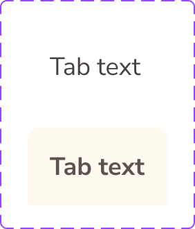

# Tab

The **Tab** component is documented from Figma component-set metadata and pending token-level verification.

## Overview

In Figma, this component is defined as a `COMPONENT_SET` (`Tab`) with the following properties:

- `State`: `Default`, `Selected`
- `Change_Tab_Text`: `TEXT` (default: `TBD`)

Source: [Tab in Figma](https://www.figma.com/design/3hGC1ju0d5AKzaoI9pKIyu/PFB---Design-System?node-id=2429-2493)

### Visual Proof

- Screenshot: [Captured (2026-02-23)](https://figma-alpha-api.s3.us-west-2.amazonaws.com/images/2f060457-d43c-42d3-a56e-77ffc7ad8a6a)
- Source node: `2429:2493`
- Image hash: `5427d510bf0c42c050b683cefeb02adaefda37f8fdc1f3de74ec5149cc85c116`
- Variants captured: `2`
- Artifact: `../_generated/visual-proofs/tab.json`

## Anatomy

1. **Tab text** — Width 69, Height 24, Border weight 1, Text color `#5D5252`, Text align LEFT, Text style Nunito Sans/Bold/18

## Component API

### Properties

| Name | Type | Default | Required | Description |
| --- | --- | --- | --- | --- |
| State | VARIANT | Default | true | Variant selector. |
| Change_Tab_Text#2429:65 | TEXT |  | false | Text content value. |

## Visual Specifications

### Per-variant attributes

#### State=Selected

- **tab_text**: Text color `#5D5252`, Text style Nunito Sans/Bold/18
- **container**: Background `#FFFAF0`

#### State=Default

- **tab_text**: Text color `#483F3F`, Text style Nunito Sans/18

### Layout and spacing

Auto-layout tree describing direction, alignment, resizing, spacing, and padding for each node.

| Node | Direction | Alignment | H Sizing | V Sizing | Item Spacing | Padding (T/R/B/L) |
| --- | --- | --- | --- | --- | --- | --- |
| container | Horizontal | Center center | Fixed | Fixed | 0 | 16/16/16/16 |
| tab_text | — | — | Fixed | Fixed | — | — |

## Variants

| Variant | Differentiating token(s) | Fallback value(s) | Visual indicator |
| --- | --- | --- | --- |
| `State=Default` | `TBD` | `TBD` | Variant captured from Figma property `State`. |
| `State=Selected` | `TBD` | `TBD` | Variant captured from Figma property `State`. |

## States

State variants in Figma:

- `default`
- `selected`

## Usage Guidelines

### Behavior

- **When to use**: Use Tab when this pattern is needed in the interface and matches its Figma variants.
- **When not to use**: Do not use Tab for scenarios not represented by its current variant/property contract.
- **Do**: Use the variant and property contract exactly as defined in Figma. Validate visual behavior before promoting to ready status.
- **Don't**: Do not overload this component with semantics it was not designed for. Do not hardcode colors or spacing outside the token system.
- Responsive behavior: `TBD`
- Overflow / truncation behavior: `TBD`
- i18n / RTL behavior: `TBD`

### Examples

- Basic example: use the default variant in its target layout.
- Contextual example: compose this component inside its parent pattern.

## Content Guidelines

- Keep content concise and aligned with product voice.
- Do not exceed space available in the default variant without overflow handling.

## Accessibility

### 1. ARIA role and semantics

- Role: `TBD`.

### 2. Keyboard navigation

- Keyboard behavior is `TBD` pending interaction audit.

### 3. Focus management

- Inner focus token: `TBD`.
- Outer focus token: `TBD`.

### 4. Labeling

- Provide an accessible name when interactive.
- Avoid redundant announcements for decorative content.

### 5. Contrast and visibility

- Contrast requirements are `TBD (pending audit)`.

## Related Components

- `TBD`

## Gaps / TBD

- [ ] [SCHEMA_TBD] `token_mapping.container.background.state=Default` is `TBD`. Specification value is unresolved.
- [ ] [SCHEMA_TBD] `token_mapping.container.background.state=Selected` is `TBD`. Specification value is unresolved.
- [ ] [CONTENT_UNKNOWN] `properties.[1].default` is `TBD`. Content/anatomy/property detail is unresolved.
- [ ] [A11Y_TBD] `accessibility.role` is `TBD`. Accessibility detail is unresolved.
