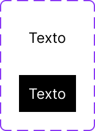

# BotN

Auto-generated component documentation from Figma capture.

## Overview

- Purpose: TBD
- Figma component set: `BotN`.
- Variant properties: TBD.
- Source: [BotN in Figma](https://www.figma.com/file/rYOptx0KbO77Z6EJYadlvN/Caca?node-id=1:23&surface=design).

### Visual Proof

- Screenshot: [Captured (2026-03-10)](https://figma-alpha-api.s3.us-west-2.amazonaws.com/images/4e6c5181-64f2-479d-8943-726debfd4b6d)
- Source node: `1:23`
- Image hash: `16bd90f28dc5ecbacd7fef48450245ba98270c4f00b6a5bbe3c591c2303ec19c`
- Variants captured: `2`
- Artifact: `../_generated/visual-proofs/bot_n.json`

## Anatomy

- **Variant=Accent** (COMPONENT): 48×31
- **Variant=Default** (COMPONENT): 48×31

## Component API

| Variant | VARIANT | Default | Yes | - | TBD |

## Visual Specifications

- `TBD`

## Variants

| Variant | Token | Fallback | Notes |
| --- | --- | --- | --- |
| N/A | - | - | No variants found |

## States

- Default: `TBD`.
- Other states: `TBD`.

## Usage Guidelines

### When to use

- TBD

### When not to use

- TBD

## Content Guidelines

- Keep labels concise and task-oriented.
- Preserve consistent naming across variant values.

## Accessibility

- ARIA: TBD
- Keyboard: TBD
- Focus: `Semantic.Color.Focus-Outline.Inner` (`#FFFFFF`) and `Semantic.Color.Focus-Outline.Outer` (`#567680`).
- Hit area: `A11y.A11y.Dimension.Min-Hit-Area` (`24px`) and `Primitives.Dimension.A11y.Min-Hit-Area-Mobile-AAA` (`48px`).
- Contrast: TBD (pending audit)

## Related Components

- [TBD](tbd.md): TBD

## Gaps / TBD

- [ ] [CONTENT_UNKNOWN] Complete usage, accessibility, and token mapping details with product evidence.

<!-- AUTO-GENERATED-ANATOMY:START -->
<!--
  ⚠️ AUTO-GENERATED: DO NOT EDIT
  Source: docs/_spec/components/bot_n.yml
  Generated by: ds-spec-to-markdown
-->
1. **Variant=Accent**
2. **Variant=Default**

<!-- AUTO-GENERATED-ANATOMY:END -->

<!-- AUTO-GENERATED-PROPERTIES:START -->
<!--
  ⚠️ AUTO-GENERATED: DO NOT EDIT
  Source: docs/_spec/components/bot_n.yml
  Generated by: ds-spec-to-markdown
-->
| Name | Type | Default | Required | Description | Narrative Notes |
| --- | --- | --- | --- | --- | --- |
| Variant | VARIANT | Default | true | Variant selector. |  |

<!-- AUTO-GENERATED-PROPERTIES:END -->

<!-- AUTO-GENERATED-VISUALS:START -->
<!--
  ⚠️ AUTO-GENERATED: DO NOT EDIT
  Source: docs/_spec/components/bot_n.yml
  Generated by: ds-spec-to-markdown
-->
### Per-variant attributes

- `TBD`

### Layout and spacing

| Node | Direction | Alignment | H Sizing | V Sizing | Item Spacing | Padding (T/R/B/L) |
| --- | --- | --- | --- | --- | --- | --- |
| botón | NONE | AUTO | FIXED | FIXED | - | — |
| Variant=Accent | HORIZONTAL | CENTER | FIXED | FIXED | 8 | 8/8/8/8 |
| Texto | NONE | AUTO | FIXED | FIXED | - | — |
| Variant=Default | HORIZONTAL | CENTER | FIXED | FIXED | 8 | 8/8/8/8 |
| Texto | NONE | AUTO | FIXED | FIXED | - | — |

<!-- AUTO-GENERATED-VISUALS:END -->

<!-- AUTO-GENERATED-VARIANTS:START -->
<!--
  ⚠️ AUTO-GENERATED: DO NOT EDIT
  Source: docs/_spec/components/bot_n.yml
  Generated by: ds-spec-to-markdown
-->
| Variant | Token | Fallback | Notes |
| --- | --- | --- | --- |
| `N/A` | `TBD` | `TBD` | No variant axis detected. |

<!-- AUTO-GENERATED-VARIANTS:END -->
