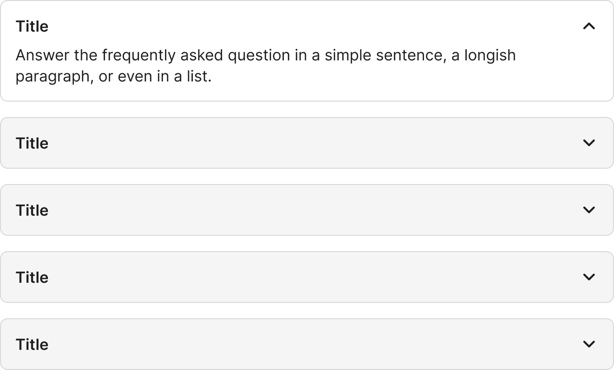

# Accordion

Auto-generated placeholder created during Figma capture workflow.

## Overview

- Purpose: TBD
- Figma component set: 7753:4779
- Variant properties: TBD
- Artwork source instance: Required hidden instance used to drive Anatomy, Properties, and Layout and spacing sections.

### Visual Proof

- Screenshot: [Captured (2026-02-23)](https://figma-alpha-api.s3.us-west-2.amazonaws.com/images/4927dff5-56ec-45d0-9e7b-5a449b24917d)
- Source node: `7753:4779`
- Image hash: `ed2e533764ee974360a0553ecb2d470d07294f0502353ef0a3eccc5f23a7964f`
- Variants captured: `1`
- Artifact: `../_generated/visual-proofs/accordion.json`

## Anatomy

1. **Container**: TBD
2. **Primary element**: TBD
