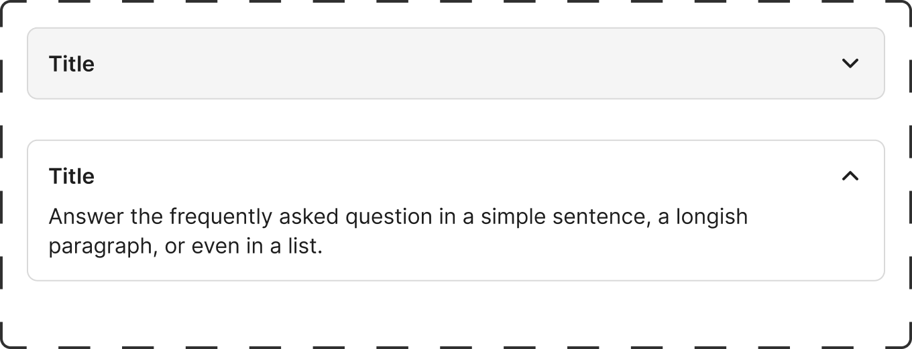

# AccordionItem

Auto-generated placeholder created during Figma capture workflow.

## Overview

- Purpose: TBD
- Figma component set: 7753:4634
- Variant properties: TBD
- Artwork source instance: Required hidden instance used to drive Anatomy, Properties, and Layout and spacing sections.

### Visual Proof

- Screenshot: [Captured (2026-02-23)](https://figma-alpha-api.s3.us-west-2.amazonaws.com/images/f57e6e72-936b-4d4c-8be4-732c574d38b2)
- Source node: `7753:4634`
- Image hash: `40b2bc85d3a3b69f5298ab6a1c47fd2f96e6a41c29ae5ac9087ddaf0c5f18f10`
- Variants captured: `2`
- Artifact: `../_generated/visual-proofs/accordion_item.json`

## Anatomy

1. **Container**: TBD
2. **Primary element**: TBD
