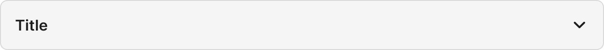

# StateClosed

Auto-generated placeholder created during Figma capture workflow.

## Overview

- Purpose: TBD
- Figma component set: 7723:4485
- Variant properties: TBD
- Artwork source instance: Required hidden instance used to drive Anatomy, Properties, and Layout and spacing sections.

### Visual Proof

- Screenshot: [Captured (2026-02-23)](https://figma-alpha-api.s3.us-west-2.amazonaws.com/images/70749919-8bb4-4b5e-837e-ef4cb3b9e49a)
- Source node: `7723:4485`
- Image hash: `7210254ec41a84acc49b8a25d0fc24b0186a4bb3962c8ca4ff7444e921ea8508`
- Variants captured: `1`
- Artifact: `../_generated/visual-proofs/state_closed.json`

## Anatomy

1. **Container**: TBD
2. **Primary element**: TBD
